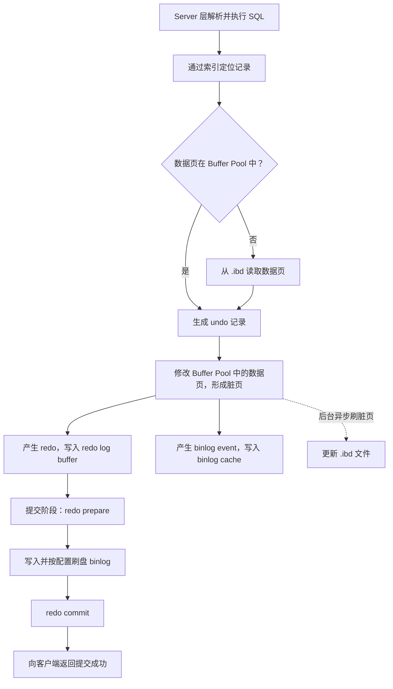

> [!info] 当前面试主入口
> [[MySQL八股文/MySQL面试精炼笔记/00-MySQL面试知识地图]]
> 本文为完整 Reference，需要补细节时再查。

InnoDB 是MySQL 数据库处理数据存储、检索、更新等底层操作的“核心引擎


面试： InnoDB 采用 Buffer Pool 和 WAL 机制。更新数据时，首先在 Buffer Pool 中修改数据页并形成脏页，同时生成 undo 用于回滚和 MVCC，生成 redo 用于崩溃恢复。事务提交时不要求立即把脏页刷入 `.ibd`，而是优先保证 redo 持久化。由于 MySQL Server 层还要写 binlog，因此提交过程通过 redo prepare、binlog 写入、redo commit 的两阶段提交保证两份日志一致。后续后台线程再根据 checkpoint 等机制异步刷脏页。


![[Pasted image 20260817143059.png]]


这张图描述的是 **MySQL Server + InnoDB 执行更新、事务提交和崩溃恢复的过程**。图中没有额外操作指令，只有架构信息。它和你前面提到的“覆盖索引”属于两个不同主题：覆盖索引解决查询是否需要回表；这张图重点解释数据修改后如何保证性能、事务回滚和持久性。

## 一、先看懂整张图

可以把它理解成三个区域：

| 区域        | 图中部件                                          | 核心作用                         |
| --------- | --------------------------------------------- | ---------------------------- |
| Server 层  | binlog cache、binlog                           | 记录数据库发生过什么逻辑变化，用于复制、审计和时间点恢复 |
| InnoDB 内存 | Buffer Pool、AHI、redo log buffer、Change Buffer | 加速访问，暂存数据页和日志                |
| InnoDB 磁盘 | `.ibd`、undo 表空间、redo log                      | 持久化数据，支持事务回滚和崩溃恢复            |

最简单的类比是：

- `.ibd` 文件：档案仓库。
- Buffer Pool：当前工作的办公桌。
- undo log：修改前的旧稿，用来撤销和提供历史版本。
- redo log：已经做过哪些修改的施工记录。
- binlog：整个数据库对外统一的业务流水。
- Change Buffer：暂时不打开档案页，先登记“以后要改什么”。
- 自适应哈希索引：InnoDB 自动生成的快捷目录。

## 二、各个部件的准确作用

### 1. Buffer Pool

Buffer Pool 是 InnoDB 最重要的内存区域，缓存的不是一条条 Java 对象，而是磁盘中的数据页和索引页。

查询时，InnoDB 先找 Buffer Pool；不存在才从 `.ibd` 文件读取。更新时也通常先修改 Buffer Pool 中的数据页，修改后的页面称为 **脏页**。

事务提交并不要求脏页马上写回 `.ibd`。这正是 InnoDB 性能较高的重要原因。

### 2. `.ibd` 文件

它保存表的数据页和索引页。在 InnoDB 中：

- 聚簇索引叶子节点保存完整行数据。
- 二级索引叶子节点保存索引列和主键值。
- 表数据本身也组织在聚簇索引中。

脏页由后台线程根据 checkpoint、内存压力等条件异步刷入 `.ibd`。

### 3. 自适应哈希索引 AHI

Adaptive Hash Index 是 InnoDB 根据 B+Tree 索引的访问热点自动建立的内存哈希结构。

它的特点是：

- 由 InnoDB 自动创建和维护。
- 用户不能通过 `CREATE INDEX` 指定。
- 用于加速部分频繁的等值查询。
- 数据来源仍然是 Buffer Pool 中的 B+Tree 页面。
- 它不是持久化数据，重启后可以重新构建。

它与覆盖索引完全不同：AHI 是内部缓存结构；覆盖索引是“某个索引恰好包含查询需要的全部列”。

### 4. undo log

undo log 保存修改前的信息，主要有两个用途：

- 事务回滚：把修改恢复到以前的状态。
- MVCC：为其他事务提供符合其 Read View 的历史版本。

需要纠正图片中容易产生的误解：undo log 不是一个类似 redo log buffer 的独立纯内存盒子。undo 记录存储在 undo log 页中，这些页可以缓存在 Buffer Pool，最终持久化到 undo 表空间。

### 5. Change Buffer

当要修改一个不在 Buffer Pool 中的二级索引页时，如果立刻读取该页会产生一次随机磁盘读取。Change Buffer 可以先记录这个修改，等索引页以后被读取时再进行 merge。

它主要适用于非唯一二级索引。唯一索引通常需要把索引页读进来检查唯一性，因此不适合单纯延迟处理。

Change Buffer 是 Buffer Pool 的组成部分，并且存在持久化表示；它不是独立于 Buffer Pool 的普通缓存。

### 6. redo log buffer 与 redo log

redo log buffer 位于内存，暂存 InnoDB 产生的 redo 记录；redo log 文件位于磁盘。

redo 记录描述的是数据页发生了什么物理或页级变化。它解决的问题是：

> 数据页尚未写回 `.ibd`，数据库就崩溃了，已经提交的数据怎么办？

重启后，InnoDB 可以根据 redo 重做这些修改。

这就是 WAL：**Write-Ahead Logging，先写日志，再写数据页**。相较于立即随机写很多数据页，先顺序写 redo 通常成本更低。

注意版本差异：较早版本常把 redo 文件称为 `ib_logfile0`、`ib_logfile1`；MySQL 8.0.30 之后默认使用 `#innodb_redo` 目录中的 `#ib_redo*` 文件。

### 7. binlog cache 与 binlog

binlog 属于 MySQL Server 层，不属于 InnoDB。

事务执行过程中，binlog event 先进入当前会话的 binlog cache；提交时再写入 binlog 文件。它主要用于：

- 主从复制。
- 数据审计。
- 基于备份的时间点恢复。
- 增量数据订阅。

redo 和 binlog不能互相替代：

|对比|redo log|binlog|
|---|---|---|
|所属层|InnoDB|MySQL Server|
|内容|页级、物理性质的修改|逻辑事件或行变更|
|主要用途|本机崩溃恢复|复制、归档、时间点恢复|
|生命周期|空间可循环复用|按文件持续归档|
|是否依赖引擎|InnoDB 特有|Server 层，支持多种引擎|

## 三、一次 UPDATE 的完整流程

假设执行：

```
UPDATE employees SET age = age + 1 WHERE id = 100;
```

可以按下面的顺序理解：

````

````

这是便于理解的逻辑顺序，内部实现还会涉及锁、MVCC、LSN、mini-transaction、group commit 等机制。

最关键的结论是：

> 事务提交成功时，数据页不一定已经写入 `.ibd`；只要所需 redo 已可靠持久化，崩溃后就可以恢复数据页。

## 四、为什么需要两阶段提交

同一个事务既要写 InnoDB redo，又要写 Server 层 binlog。如果没有协调机制，就可能出现：

- redo 有记录、binlog 没记录：本机恢复出事务，但从库收不到。
- binlog 有记录、redo 没记录：从库执行了事务，但主库崩溃恢复后没有该事务。

MySQL 使用内部两阶段提交协调两份日志：

1. InnoDB 把 redo 标记为 `prepare`。
2. Server 写入 binlog，并根据配置刷盘。
3. InnoDB 把 redo 标记为 `commit`。
4. 返回提交成功。

崩溃恢复时，对于处于 `prepare` 状态的事务：

- 如果在 binlog 中找到对应事务，则提交。
- 如果 binlog 中没有，则回滚。

因此，两阶段提交的核心目的不是“让提交分两次执行”，而是保证 **redo 与 binlog 的事务状态一致**。

## 五、崩溃恢复时分别做什么

服务器异常退出后重新启动：

- redo log：重放必要修改，使数据页恢复到正确状态。
- undo log：回滚崩溃时尚未提交的事务。
- binlog：帮助判断 prepared 事务是否已经完成 binlog 提交，同时用于复制和时间点恢复。
- Buffer Pool、AHI：属于内存状态，重新加载或重建。
- Change Buffer：未合并的持久化变更可以继续恢复和合并。

面试中不要简单说“binlog负责数据库崩溃恢复”。更严谨的说法是：

> InnoDB 本机页级崩溃恢复主要依靠 redo 和 undo；binlog参与两阶段提交的一致性判断，并主要服务于复制和时间点恢复。

## 六、两个重要持久化参数

生产环境追求最强持久性时，通常关注：

```
innodb_flush_log_at_trx_commit = 1
sync_binlog = 1
```

前者要求事务提交时将 redo 持久化，后者控制 binlog 同步到稳定存储的频率。两者设为 `1` 最安全，但会增加刷盘开销；MySQL 会使用 group commit 合并多个事务的部分刷盘工作。

这里还要区分“写入操作系统缓存”和“执行 fsync 持久化到稳定存储”，两者不能在面试中混为一谈。

## 七、这张图与覆盖索引的关系

索引概念可以这样分类：

|分类维度|常见概念|
|---|---|
|数据组织方式|聚簇索引、二级索引|
|数据结构|B+Tree、Hash、Fulltext、Spatial|
|列的组织方式|单列索引、联合索引、前缀索引|
|约束属性|普通索引、唯一索引、主键索引|
|查询效果|覆盖索引、索引条件下推|
|InnoDB 内部优化|自适应哈希索引、Change Buffer|

覆盖索引不是一种需要特殊语法创建的索引类型，而是 **索引与某条查询之间的关系**。

例如：

```
CREATE INDEX idx_dept_age ON employees(dept_id, age);

SELECT age FROM employees WHERE dept_id = 1;
```

这条查询可以只读取 `idx_dept_age`，通常在传统 `EXPLAIN` 的 `Extra` 中看到 `Using index`。

但要区分：

- `Using index`：查询所需列可从索引树取得，通常不需要常规回表。
- `Using index condition`：使用了 ICP，先在二级索引中过滤，但符合条件的记录仍可能回聚簇索引取整行。
- `Using where; Using index`：使用覆盖索引，同时还需要执行剩余条件过滤。

覆盖索引也不是无条件的“性能最高境界”。索引列越多，索引越大，写入维护成本和 Buffer Pool 占用越高；在 MVCC 等特殊情况下，InnoDB 也可能为了判断可见性访问聚簇索引。

## 八、面试规范表述

可以直接使用下面这段：

> InnoDB 采用 Buffer Pool 和 WAL 机制。更新数据时，首先在 Buffer Pool 中修改数据页并形成脏页，同时生成 undo 用于回滚和 MVCC，生成 redo 用于崩溃恢复。事务提交时不要求立即把脏页刷入 `.ibd`，而是优先保证 redo 持久化。由于 MySQL Server 层还要写 binlog，因此提交过程通过 redo prepare、binlog 写入、redo commit 的两阶段提交保证两份日志一致。后续后台线程再根据 checkpoint 等机制异步刷脏页。

关于三种日志，可以这样说：

> undo 负责“如何回到过去”，redo 负责“如何恢复已经完成的修改”，binlog 负责“整个数据库对外记录发生了什么”，三者分别服务于事务回滚与 MVCC、本机崩溃恢复、复制与时间点恢复。

## 九、高频面试题与答题要点

1. **事务提交后，数据一定已经写入 `.ibd` 吗？**  
    不一定。通常先保证 redo 持久化，数据页由后台异步刷盘。
    
2. **为什么有 redo 还需要 binlog？**  
    redo 是 InnoDB 的循环物理日志，服务于本机恢复；binlog 是 Server 层归档日志，服务于复制和时间点恢复。
    
3. **为什么要两阶段提交？**  
    保证 redo 和 binlog 对同一事务具有一致状态，避免主库恢复结果与复制数据不一致。
    
4. **undo log 只用于回滚吗？**  
    不是，还用于 MVCC，通过版本链向一致性读提供历史版本。
    
5. **Change Buffer 能缓存主键更新吗？**  
    主要缓存尚未进入 Buffer Pool 的非唯一二级索引页修改，不用于一般主键页修改。
    
6. **redo 为什么比直接刷数据页快？**  
    redo 更接近顺序追加；数据页刷盘可能是分散的随机 I/O，而且一次页修改可以由较小的 redo 描述。
    
7. **`Using index condition` 是覆盖索引吗？**  
    不是。它表示索引条件下推，减少回表次数，但仍可能回表。
    
8. **自适应哈希索引和普通 Hash 索引有什么区别？**  
    AHI 由 InnoDB根据访问热点自动在内存中建立，用户不能直接指定，也不是表的持久化索引定义。
    
9. **崩溃时 redo 处于 prepare 怎么处理？**  
    检查 binlog 中是否存在对应事务；存在则提交，不存在则回滚。
    
10. **怎样获得较强的事务持久性？**  
    通常使用 `innodb_flush_log_at_trx_commit=1` 和 `sync_binlog=1`，同时接受更高的同步刷盘成本。
    

参考的是 MySQL 8.0 官方文档中的 [InnoDB Crash Recovery](https://dev.mysql.com/doc/refman/8.0/en/innodb-recovery.html)、[Binary Log](https://dev.mysql.com/doc/refman/8.0/en/binary-log.html)、[Redo Log Buffer](https://dev.mysql.com/doc/refman/8.0/en/innodb-redo-log-buffer.html) 和 [EXPLAIN Output](https://dev.mysql.com/doc/refman/8.0/en/explain-output.html)。
