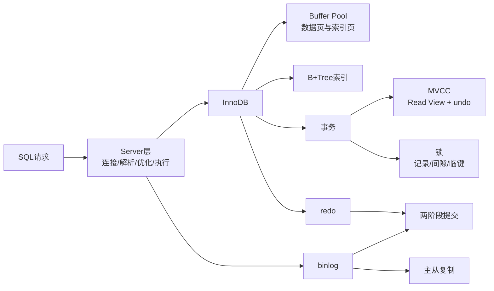

# MySQL 面试知识地图

> [!important] 使用范围
> 以下笔记以 **MySQL 8.0 + InnoDB** 为主。目标是先给标准答案，再补机制、场景和边界，避免绝对化表达。

## 复习入口

1. [[01-InnoDB架构与日志]]
2. [[02-索引与SQL优化]]
3. [[03-事务-MVCC与锁]]
4. [[04-主从复制与高可用]]
5. [[05-高频面试速记与自测]]
6. [[06-数据库类型拓展速览]]（低优先级）

## 一张图串起来



## 五条主线

```text
查询为什么快：B+Tree 减少扫描页，Buffer Pool 减少磁盘读取。
索引为什么会慢：扫描范围大、回表多、排序/临时表、锁等待。
事务怎样隔离：快照读依靠 MVCC，当前读和写操作依靠锁。
提交后怎样恢复：undo 支持回滚，redo 支持本机崩溃恢复，binlog 支持复制与时间点恢复。
并发为什么卡住：事务持有冲突锁形成等待；等待关系成环就是死锁。
```

## 标准答题模板

面试回答按四步组织：

```text
1. 结论：先用一句话回答是什么。
2. 机制：说明底层依靠什么实现。
3. 场景：给一个 SQL 或业务例子。
4. 边界：补充“通常、取决于执行计划、不能绝对化”。
```

示例：

> 覆盖索引是指查询需要的列都能从某个索引中取得，因此通常不需要回表。InnoDB 二级索引叶子节点还包含主键，所以主键也可能被覆盖。但是否真的使用覆盖索引，最终要通过执行计划和实际执行验证。

## 推荐复习顺序

```text
第一轮：只看每篇的“面试标准回答”
第二轮：看机制表格和 SQL 示例
第三轮：闭卷回答 05 中的问题
第四轮：用项目 SQL 解释索引、事务和锁
```

## 官方参考

- [MySQL 8.0 Reference Manual](https://dev.mysql.com/doc/refman/8.0/en/)
- [InnoDB Locking](https://dev.mysql.com/doc/refman/8.0/en/innodb-locking.html)
- [InnoDB Consistent Reads](https://dev.mysql.com/doc/refman/8.0/en/innodb-consistent-read.html)
- [Multiple-Column Indexes](https://dev.mysql.com/doc/refman/8.0/en/multiple-column-indexes.html)
- [EXPLAIN](https://dev.mysql.com/doc/refman/8.0/en/explain.html)
- [Replication](https://dev.mysql.com/doc/refman/8.0/en/replication.html)

