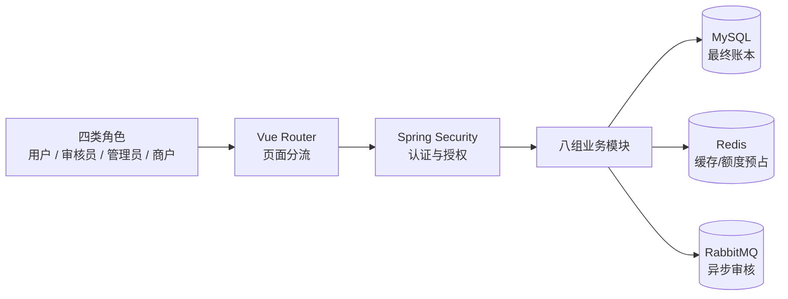

# 一、总图
SmartRenew 是一个面向国补/以旧换新的多角色模块化单体，完成“活动配置、用户申请、审核、发券、商户核销”的业务闭环。



四角、八模、三基、一条链
四个角色，八组模块，MySQL/Redis/RabbitMQ三个基础设施，一条补贴业务链。

# 二、四类角色以及权限
| 角色         | 可以访问的页面                 | 权限边界          |
| ---------- | ----------------------- | ------------- |
| `USER`     | 活动、申请创建/查询、补贴券          | 只能操作本人申请、材料和券 |
| `REVIEWER` | 审核任务、申请审核详情             | 只能执行审核范围内操作   |
| `ADMIN`    | 仪表盘、活动、规则、额度、申请、发券和核销查询 | 管理接口需要管理员角色   |
| `MERCHANT` | 验券、核销记录、核销详情            | 必须校验商户归属和适用品类 |
- 角色面试描述：
项目有用户、审核员、管理员和商户四类角色。审核员没有独立登录页，所有角色共用统一登录入口，登录后根据后端返回的角色跳转到对应工作台。管理员和审核员都能进入审核中心，所以前端把它们统一抽象为`canReview`。但两者权限并不完全相同：审核员只能访问审核相关页面，而且通常只能处理自己领取的任务；管理员除了拥有活动、规则和额度管理权限外，也可以执行审核，并且拥有更高的任务处理权限。前端路由只负责页面分流，真正的权限校验仍在后端完成。

- 权限设计：
当前项目采用RBAC和资源级Guard。RBAC根据USER、REVIEWER、ADMIN、MERCHANT进行角色控制，Resource Guard进一步校验申请、审核任务和商户记录的资源归属。例如审核员必须是REVIEWER或ADMIN，普通审核员还只能处理自己领取的任务。若未来角色和权限数量快速增长，可以引入角色—权限表；如果权限还依赖地区、金额、资源状态等动态属性，则可以进一步采用ABAC。


# 三、为什么选择模块化单体


项目不是微服务：八组模块都运行在同一个Spring Boot进程中，共享数据库和本地事务，只通过包结构与Service接口划分职责。

## 它解决什么问题

既要防止所有代码混在一起，又不想承担微服务的部署、网络通信、服务治理和分布式事务成本。

后端采用“按业务能力分包”，而不是全局放置：

```
controller/
service/
mapper/
```

而是：

```
application/controller
application/service
application/mapper

review/controller
review/service
review/mapper
```

这样一个业务功能的代码集中在一个模块内。

## 容易踩什么坑

- 只有目录是模块化，模块之间仍直接调用对方Mapper或修改对方表。
- `common`逐渐变成什么都放的公共垃圾包。
- 所有模块共享数据库，表结构耦合后很难独立拆分。
- 因为用了RabbitMQ就误称为微服务。是否微服务取决于能否独立运行和部署。

## 替代方案

- 当前规模：保持模块化单体，可用ArchUnit检查模块依赖。
- 边界需要更强：拆成Maven多模块。
- 出现独立团队、独立扩缩容或故障隔离需求后，再拆微服务。
- 若拆分，审核或AI通常比申请、额度更适合优先独立，因为核心资金事务应谨慎拆分。

面试追问：
## 面试官可能追问：用了RabbitMQ为什么不是微服务？

回答：

> RabbitMQ解决的是异步通信、解耦和削峰问题，不决定系统是不是微服务。微服务的核心判断标准是模块能否独立运行、独立部署、独立扩缩容。当前项目的审核消费者虽然通过RabbitMQ异步处理，但仍属于同一个Spring Boot应用体系，数据库和部署也没有完全独立。

## 面试官可能追问：模块化单体有什么缺点？

回答：

> 最大的问题是模块仍然共享进程和数据库。如果模块之间没有严格约束，可能出现跨模块直接调用Mapper、直接修改其他模块数据，最后只是“目录看起来模块化”，实际上仍然高度耦合。另外，数据库表结构共享，也会增加未来拆分的难度。

## 面试官可能追问：什么时候考虑拆微服务？

回答：

> 当出现以下情况时，我会考虑拆分：某个模块需要独立扩缩容，某个模块故障不能影响主流程，不同团队需要独立发布，或者模块有明显不同的技术栈和运维周期。这个项目中，审核或AI模块通常比申请和额度模块更适合优先拆分，因为申请和额度涉及核心业务事务，拆分风险更高。

## “替代方案”怎么答？

可以这样说：

> 如果项目继续扩大，我会先加强模块边界，例如通过Maven多模块、依赖检查或ArchUnit限制跨模块访问。再根据实际压力选择拆分，而不是一开始就全部微服务化。审核模块和AI模块可以优先独立，额度和申请模块则要先设计好事件一致性和补偿机制。

注意：如果你没有实际配置ArchUnit，不要说“项目已经使用了ArchUnit”，要说：

> “后续可以使用ArchUnit检查模块依赖。”

# 四、八组业务模块

面试复述：
我把后端按业务能力划分为八个领域：认证安全、活动预检、申请材料、审核、额度发券、商户核销、AI助手和监控系统。它们对应的是一条完整业务链：用户先查看活动并进行资格预检，然后创建申请、上传材料、提交审核，审核通过后扣减额度并发放补贴券，最后由商户验券核销。

这些模块运行在同一个Spring Boot模块化单体中，每个模块内部有自己的Controller、Service和Mapper。模块之间通过服务接口协作，MySQL保存业务事实，Redis负责缓存和额度预占，RabbitMQ负责异步审核。

记忆口诀：

> **认、活、申、审、额、商、智、监**

|模块|解决的问题|常见坑|替代设计|
|---|---|---|---|
|`auth/security`|登录、JWT、角色和资源授权|只认证不授权；JWT无法撤销|OAuth2资源服务器、外部身份平台|
|`campaign/precheck`|活动规则配置和资格初筛|修改规则影响历史申请|不可变规则版本、规则引擎|
|`application`|草稿、材料、提交、补料|任意修改状态；重复提交|显式状态机、工作流引擎|
|`review`|自动/人工审核与任务流转|同步审核阻塞；重复处理|数据库任务队列、事件流平台|
|`quota/voucher`|防止额度超发并生成补贴券|Redis被当成账本；重复发券|MySQL原子扣减、独立预留账本|
|`merchant`|验券和一次性核销|重复请求、跨商户核销|幂等记录、签名券码、清算账本|
|`ai`|政策和流程解释|幻觉参与资金决策|纯知识检索或人工客服|
|`monitor/system`|排查故障、审计、业务指标|只监控CPU，不监控业务失败|OpenTelemetry和外部告警平台|

其中`dashboard`一级包和管理员仪表盘页面确实存在，但架构文档没有把它列入八组核心模块，因此当前只能把它看作独立的查询入口，不能在未读源码时断言具体统计逻辑。

## 八个模块怎么分别说

|模块|面试说法|
|---|---|
|`auth/security`|负责登录、JWT认证、角色权限和资源访问控制，避免未登录或越权访问|
|`campaign/precheck`|管理活动和规则，并提前判断用户是否具备申请资格|
|`application`|管理申请草稿、材料上传、正式提交和补料重提|
|`review`|负责自动审核、人工审核任务和审核结果流转|
|`quota/voucher`|负责额度扣减和补贴券发放，重点防止超发和重复发券|
|`merchant`|负责商户验券和一次性核销，重点保证幂等和商户归属|
|`ai`|提供政策和流程解释，但不参与审核、额度或核销决策|
|`monitor/system`|提供Trace ID、操作日志、运行指标和系统基础能力|

这里要注意：

> “八组业务模块”是业务上的归类，不完全等于八个Java包。

因为文档把：

```
campaign + precheck
quota + voucher
auth + security
monitor + system
```

分别合并成业务组，所以实际包名数量会多于八个。

## 面试官追问“挑一个模块展开”

你可以选择最有技术含量的`quota/voucher`：

> 额度和发券模块主要解决高并发下额度超发和重复发券的问题。系统先通过Redis进行快速额度预占，再由MySQL通过条件更新做最终扣减，MySQL才是最终账本。额度、额度日志、补贴券和发券日志在事务中提交，同时通过申请编号唯一约束防止重复发券。如果数据库扣减失败，还需要补偿Redis预占结果。

这个回答体现了：

```
业务问题：额度不能超发
性能方案：Redis预占
最终一致：MySQL裁决
幂等保护：唯一约束
失败处理：补偿机制
```

## 如果问申请模块

> 申请模块不是简单保存一张表，而是管理申请生命周期。创建申请时先保存为`DRAFT`，并固化当时的规则快照，避免管理员之后修改规则影响历史申请。用户补齐材料后显式提交，审核要求补料时进入`NEED_MORE_INFO`，补料后再次提交。

## 如果问审核模块

> 审核模块同时支持自动审核和人工审核。规则不要求材料时可以自动通过；要求材料时进入人工任务。审核员需要先领取任务，普通审核员只能处理自己领取的任务，管理员可以拥有更高的处理权限。这里重点解决的是审核流程异步化、任务归属和重复提交问题。

## 如果问商户模块

> 商户模块解决补贴券被重复使用或跨商户核销的问题。请求需要携带幂等键，系统还要校验商户归属，并通过券状态和数据库唯一约束保证一张券只能成功核销一次。

## 如果问AI模块

> AI模块定位是只读问答，帮助用户理解政策和流程。它不参与审核、额度、发券或核销决策，避免模型幻觉直接影响资金和政策结果。低置信度时应该降级为提示用户查看官方规则或转人工。

## 如果问这些模块的共同风险

可以总结为四类：

```
认证模块：认证了但没有正确授权
申请模块：状态乱改、重复提交
审核模块：任务重复处理、越权审核
额度模块：超发、重复发券、失败后数据不一致
核销模块：重复核销、跨商户操作
AI模块：幻觉影响业务决策
监控模块：只看机器指标，不看业务失败
```

## dashboard怎么说

你可以这样回答，避免过度猜测：

> 项目中还有`dashboard`一级包和管理员仪表盘页面，但架构文档没有把它列为独立核心业务域。它更像是管理端的数据汇总入口，具体统计逻辑需要进一步阅读源码后再确认。