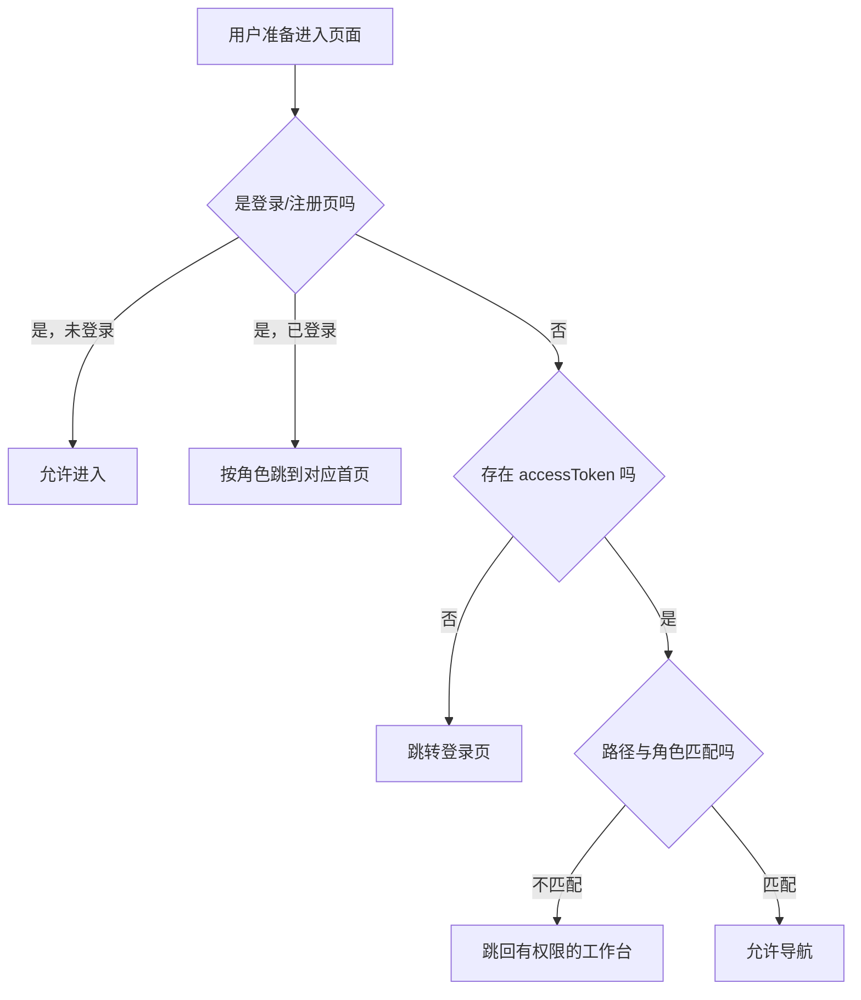

## 1.面试回答：

项目前端使用 Vue Router，通过全局导航守卫统一处理登录状态和角色跳转。系统有用户、管理员/审核员和商户三类工作台，分别对应`/u`、`/admin`和`/merchant`路径。

用户访问页面时，守卫会先判断当前路径是不是登录或注册页；如果访问受保护页面，则检查本地是否存在登录Token。没有Token就跳转到登录页。登录成功后，根据后端返回的角色跳转到对应首页：管理员进入管理首页，审核员进入审核任务页，商户进入验券页面，普通用户进入活动页面。

对于已经登录的用户，守卫还会判断角色是否匹配目标路径。例如普通用户不能进入`/admin`，非商户不能进入`/merchant`，没有审核权限的用户不能进入`/admin/review`。

但前端路由守卫只负责页面分流和用户体验，不能作为真正的安全边界。用户可以绕过前端直接调用接口，所以后端还需要通过JWT认证、角色权限和资源归属校验来保护接口。


## 2.项目路由分为三套工作台：

```
/u          普通用户工作台
/admin      管理员和审核员工作台
/merchant   商户工作台
```

全局守卫位于 [index.ts (line 102)](D:/project/SmartRenew-Platform/frontend/src/router/index.ts:102)，执行顺序是：



Vue Router中：

- 返回`true`：继续导航。
- 返回路由字符串或对象：重定向。
- 返回`false`：取消导航。

## 它解决什么问题

防止用户误入不属于自己的工作台，同时登录后直接把用户送到最常用页面。

## 容易踩什么坑

- **前端路由守卫不是安全措施。** 用户可以绕开页面直接调用HTTP接口。
- `accessToken`存在不代表令牌合法，也可能已经过期。
- 使用`startsWith('/admin')`比较路径比较脆弱，新增特殊路由时容易漏掉。
- 重定向目标判断不严谨会形成无限循环。
- 当前未保存用户原本想访问的地址，登录后只能进入默认首页。

## 替代方案

可以在每条路由上声明元数据：

```
meta: { requiresAuth: true, roles: ['ADMIN'] }
```

然后使用统一守卫读取`to.meta`。更复杂时，可由后端返回权限和菜单，但后端接口仍必须独立授权。


面试追问：
### “前端隐藏菜单是不是就安全了？”

回答：

> 不是。前端代码和请求都可以被用户控制，隐藏按钮只能避免普通误操作，不能防止恶意请求。真正安全控制必须放在后端，例如验证JWT、判断角色，以及校验当前用户是否拥有这条申请或审核任务。

### “Token存在是不是说明用户一定登录成功？”

回答：

> 不一定。前端这里只是判断本地是否存在Token，Token可能已经过期、被伪造或被服务端拒绝。最终是否认证成功，要由后端验证Token的签名、有效期和用户信息。

### “为什么不用每个页面写一堆if？”

回答：

> 使用全局导航守卫可以集中处理登录和角色分流，避免每个页面重复写相同逻辑。更规范的做法是给路由增加`meta`信息，例如声明`requiresAuth`和允许的角色，再由统一守卫处理。

## 如果让你设计替代方案

你可以这样说：

> 当前项目通过路径前缀和全局守卫实现角色分流，代码比较直观。随着页面和角色增多，我会把权限声明放到路由的`meta`字段中，例如`meta: { requiresAuth: true, roles: ['ADMIN'] }`，由统一守卫读取。这样新增页面时只配置路由，不需要继续增加大量`startsWith`判断。不过后端接口仍然必须单独做授权，前端守卫不能替代后端安全校验。


