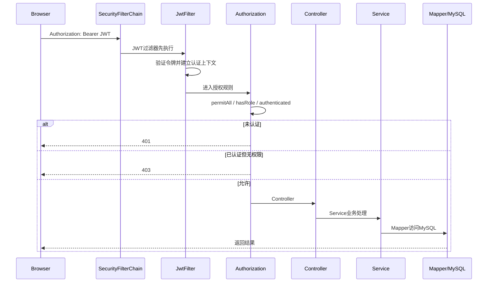

核心链路如下



这一块面试重点是回答清楚：

> **请求先验证“你是谁”，再判断“你能不能访问”，通过后才进入业务代码。**

## 60秒面试版

> 项目使用Spring Security和JWT实现无状态认证。前端登录成功后获得JWT，之后访问后端接口时通过`Authorization: Bearer <token>`携带令牌。
> 
> 请求首先进入Spring Security的`SecurityFilterChain`，项目自定义的`JwtFilter`会在`UsernamePasswordAuthenticationFilter`之前执行，验证JWT并建立当前用户的认证信息。之后授权规则判断接口是否公开、是否只需要登录，或者是否必须拥有`ADMIN`角色。
> 
> 如果没有有效身份，返回401；如果已经登录但没有访问权限，返回403；权限通过后才进入Controller、Service、Mapper和数据库。项目使用`STATELESS`，服务端不依赖Session保存登录状态。

## 请求流程记忆

记住五个字：

> **带、验、判、进、返**

```
带：请求携带Authorization Bearer JWT
验：JwtFilter验证令牌
判：Spring Security判断访问权限
进：进入Controller、Service、Mapper
返：返回业务结果，失败则返回401或403
```

完整流程：

```
Browser
  ↓
SecurityFilterChain
  ↓
JwtFilter
  ↓
认证信息 / SecurityContext
  ↓
权限判断
  ↓
Controller
  ↓
Service
  ↓
Mapper / MySQL
```

## 每个组件怎么解释

### JWT

JWT是登录成功后服务端签发的一种令牌。

它通常包含：

```
用户身份
角色信息
过期时间
签名
```

后续请求不需要每次重新提交用户名和密码，只需要携带JWT。

### JwtFilter

JwtFilter是请求过滤器，负责在业务Controller之前检查JWT。

它通常会：

```
读取Authorization请求头
提取Bearer Token
验证签名和有效期
解析用户身份和角色
写入SecurityContext
```

你面试时可以说“项目通过JwtFilter完成这些工作”。如果没有读过具体实现，不要说具体使用了哪种签名算法。

### SecurityFilterChain

它可以理解成Spring Security的“安全检查流水线”。

项目在 [SecurityConfig.java (line 29)](D:/project/SmartRenew-Platform/backend/src/main/java/com/smartrenew/platform/security/SecurityConfig.java:29) 中配置了：

```
OPTIONS请求：放行
登录、注册、健康检查：放行
/api/v1/admin/**：必须是ADMIN
其他接口：必须已认证
```

### `authenticated()`

表示：

```
只要身份认证成功，就可以继续访问
```

它不代表所有用户都能访问所有业务资源。审核员、商户和普通用户的更细权限，还需要业务层继续判断。

### `hasRole("ADMIN")`

表示：

```
必须拥有ADMIN角色
```

Spring Security中通常会把它对应为：

```
ROLE_ADMIN
```

### `STATELESS`

表示服务端不通过Session保存登录状态。

每个请求都必须自己携带JWT：

```
请求A带JWT
请求B也带JWT
请求C仍然要带JWT
```

这适合前后端分离和横向扩展。

## 401和403怎么区分

这是非常常见的面试题。

|状态码|含义|示例|
|---|---|---|
|`401 Unauthorized`|没有有效身份|没带Token、Token过期、Token签名错误|
|`403 Forbidden`|有身份，但没有权限|普通用户访问管理员接口|

记忆：

> **401是“你是谁我不知道”，403是“我知道你是谁，但你不能做这件事”。**

## 它解决什么实际问题？

### 1. 不需要服务端保存Session

多个后端实例都可以独立验证JWT，适合前后端分离和扩容。

### 2. 统一处理接口安全

不用每个Controller都自己判断Token，安全逻辑集中在Spring Security中。

### 3. 区分认证和授权

先确认用户身份，再判断用户是否有角色或资源权限。

## 面试官可能追问：前端路由守卫和JWT有什么区别？

回答：

> 前端路由守卫只负责页面分流，例如不让普通用户看到管理员菜单；JWT和后端Spring Security负责真正的接口安全。即使用户绕过前端直接调用接口，后端仍会验证JWT、角色和资源归属，所以前端守卫不能代替后端授权。

## 面试官可能追问：为什么把JwtFilter放在UsernamePasswordAuthenticationFilter之前？

回答：

> 因为需要在后续授权判断之前先建立当前用户的认证信息。过滤器链按照顺序执行，JwtFilter提前验证Token并设置认证上下文，后面的授权规则才能知道当前请求属于哪个用户、拥有哪些角色。

## 常见坑

### 1. 前端有Token不等于认证成功

Token可能：

```
已过期
签名错误
被篡改
用户已经失效
```

最终必须以后端验证结果为准。

### 2. 只写`authenticated()`可能权限过宽

如果所有接口都只要求“登录即可”，普通用户可能访问不该访问的业务。

因此还需要：

```
角色判断
资源归属判断
业务状态判断
```

### 3. `hasRole`前缀问题

代码写：

```
.hasRole("ADMIN")
```

实际权限通常是：

```
ROLE_ADMIN
```

如果数据库或JWT中角色命名不一致，可能导致明明有权限却返回403。

### 4. 关闭CSRF不能随便解释

项目使用请求头携带JWT，因此关闭CSRF比较符合当前设计。

但如果以后把JWT放在Cookie中，就需要重新评估CSRF攻击风险。

### 5. JWT退出登录不一定立即失效

JWT通常是自包含令牌，签发后服务端不会自动知道用户点击了退出。

如果要求立即撤销，需要：

```
短期Access Token
Refresh Token
Token黑名单
不透明Token
```

## 如果让你设计替代方案

可以这样回答：

> 当前项目使用自定义JwtFilter，结构比较直观。生产系统中如果希望减少自定义安全代码，我会考虑使用Spring Security OAuth2 Resource Server处理JWT验证，再通过方法级权限控制细化接口。对于强制撤销登录的场景，可以使用短期Access Token配合Refresh Token，或者使用服务端Session和HttpOnly Cookie。

## 最后背诵版

> 一次受保护请求会先携带Bearer JWT进入Spring Security过滤器链，JwtFilter负责验证令牌并建立认证上下文，随后授权规则判断接口是公开、只需认证还是需要特定角色。认证失败返回401，授权失败返回403，全部通过后才进入Controller、Service、Mapper和MySQL。项目使用无状态JWT，不依赖Session；前端路由只负责页面分流，后端Spring Security才是真正的安全边界。