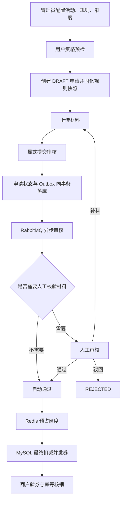

这条主流程不是简单把功能串起来，而是按照四个约束设计的：

1. 先做低成本校验，再做高成本审核。
2. 先确认资格，再消耗有限额度。
3. 关键状态必须落到MySQL，不能只依赖缓存或消息。
4. 所有可能重试的环节都必须幂等。

完整链路可以理解为：

```
配置业务规则
→ 快速判断是否值得申请
→ 固化申请依据
→ 收集证明材料
→ 用户确认提交
→ 可靠地触发审核
→ 自动或人工判断资格
→ 竞争有限额度
→ 发放补贴券
→ 商户核销
```

依据主要来自 [ARCHITECTURE.md (line 64)](D:/project/SmartRenew-Platform/docs/ARCHITECTURE.md:64)。

## 1. 管理员先配置活动、规则和额度

活动是业务容器，规则决定申请条件，额度池决定最终最多能发多少钱。

例如一个活动可能配置：

```
活动：上海市家电以旧换新
地区：上海
品类：空调
最低消费：3000元
补贴比例：10%
单笔上限：500元
是否需要发票：是
总额度：100万元
```

为什么必须先配置？

因为后面所有业务都依赖它：

```
没有活动 → 不知道申请入口是否开放
没有规则 → 不知道用户是否符合条件
没有额度 → 不知道审核通过后能否发券
```

把规则配置和用户申请分开，可以避免每次改需求都修改代码。运营人员通过配置发布新规则，程序只负责执行规则。

规则通常还需要版本化。因为活动进行期间规则可能发生变化，但已经提交的申请不能被新规则追溯影响。

面试可以这样回答：

> 活动和规则是后续流程的业务依据，因此必须先配置并版本化。配置化可以把运营变化和代码发布解耦，版本化则保证历史申请可以按照申请当时的规则解释和审计。

## 2. 用户先做资格预检

预检主要根据活动状态、地区、商品品类、价格等结构化条件，快速判断用户是否具备基本申请资格。

为什么不让用户直接创建申请？

因为完整申请后续需要：

- 写入多张数据库表。
- 上传材料。
- 发送审核消息。
- 产生人工审核任务。
- 最终参与额度竞争。

如果用户连地区或价格条件都不满足，进入后续流程只会制造无效数据和审核成本。

因此系统先安排一个便宜、快速、可重复的判断：

```
基础条件不满足 → 立即返回原因
基础条件满足 → 允许进入正式申请
```

但预检通过不等于最终审核通过。预检只能检查系统能够直接计算的条件，无法证明发票、身份证明等材料是真实的。

面试关键词是：**尽早失败、降低无效流量、改善用户体验**。

## 3. 创建`DRAFT`申请并固化规则快照

预检通过后，系统创建的是`DRAFT`草稿，而不是直接提交审核。

为什么需要草稿？

因为用户很可能无法一次完成全部操作：

- 材料尚未准备好。
- 上传过程中断。
- 某些信息需要修改。
- 用户暂时退出，稍后继续。

如果创建申请就立刻审核，审核系统会收到大量不完整申请。

因此状态设计为：

```
预检通过
→ 创建DRAFT
→ 用户补全信息和材料
→ 用户主动提交
```

更关键的是，创建申请时要保存规则快照。

假设用户8月1日创建申请时补贴比例是10%，8月2日管理员将规则改为8%。如果申请只引用当前规则，那么同一份申请在不同时间查询可能得到不同结果。

保存规则快照后，申请相当于记录：

```
这份申请按照规则V3创建
补贴比例10%
单笔上限500元
需要发票和身份证明
```

这样规则后来发生变化，也不会影响已经创建的申请。

面试可以概括为：

> DRAFT解决申请过程无法一次完成的问题，规则快照解决活动规则变化导致历史申请不可重现的问题。

## 4. 用户上传必需材料

系统根据规则快照判断申请需要哪些材料，例如发票、商品照片或者身份证明。

为什么上传材料和创建申请要分开？

文件上传本身具有不同于普通表单的特点：

- 文件较大，容易失败。
- 需要单独校验类型、大小和文件头。
- 用户可能需要多次上传或替换。
- 文件存储和业务数据库的处理方式不同。

因此先创建申请ID，再让每份材料关联这个申请，比把所有内容塞进一个请求更稳定。

项目当前只验证：

- 文件大小。
- 扩展名。
- JPEG、PNG、PDF文件头。
- 材料记录是否存在。

这些校验只能防止明显错误或伪装文件，不能证明材料的业务真实性。所以一旦规则要求材料，仍然要进入人工审核。

这里要主动区分：

```
技术合法性：是不是允许的文件
业务真实性：发票和内容是不是真的
```

前者系统可以判断，后者当前交给审核员。

## 5. 用户显式提交审核

上传完成后，用户还需要调用提交接口，而不是“最后一份文件上传成功就自动提交”。

为什么必须显式提交？

因为系统无法仅凭上传动作判断用户是否真的完成了申请：

- 用户可能还想替换材料。
- 某些非文件信息可能还未确认。
- 系统不知道当前上传的是不是最后一份材料。
- 自动提交会让用户失去最终确认机会。

显式提交是一个明确的业务边界：

```
提交之前：用户可以编辑
提交之后：进入正式审核，不能随意修改
```

提交时，系统应统一检查活动是否有效、材料是否齐全、当前状态是否允许提交等条件，然后进行状态迁移。

不能只相信前端按钮，因为用户可能重复点击、伪造请求，或者两个请求并发到达。

所以Service层必须检查类似条件：

```
当前状态必须是DRAFT或NEED_MORE_INFO
必需材料必须齐全
活动和规则必须有效
```

面试关键词是：**显式状态迁移、服务端最终校验、防止非法跳转**。

## 6. 申请状态和Outbox事件同事务落库

提交成功后，需要把申请交给审核模块。这里存在一个经典“双写问题”：

```
操作一：修改MySQL中的申请状态
操作二：向RabbitMQ发送审核消息
```

如果先改数据库再发消息：

```
数据库提交成功
→ RabbitMQ发送失败
→ 申请已经提交，但永远没人审核
```

如果先发消息再提交数据库：

```
消息发送成功
→ 数据库事务失败
→ 消费者收到一份数据库中不存在或未提交的申请
```

所以项目不在业务事务中直接依赖RabbitMQ发送结果，而是将：

```
申请状态更新
+
mq_outbox事件写入
```

放进同一个MySQL事务。

结果只有两种：

```
两个都成功
或者
两个都失败
```

事务提交后，再由Outbox发布任务把消息发送到RabbitMQ。发送失败可以根据Outbox记录继续重试。

这解决的是“数据库与消息队列无法使用同一个本地事务”的问题。

## 7. RabbitMQ异步触发审核

为什么审核不直接在提交接口中同步完成？

审核链路可能包含：

- 规则判断。
- 创建人工任务。
- 额度处理。
- 发券。
- 消息重试。
- 外部资源异常。

如果全部同步执行，用户提交接口会很慢，而且审核模块的一次异常会直接导致用户请求失败。

异步化之后：

```
HTTP请求只负责可靠提交申请
RabbitMQ负责把审核任务交给消费者
消费者独立处理审核流程
```

它带来三个好处：

- 解耦：申请模块不需要同步等待审核完成。
- 削峰：大量申请可以先进入队列，消费者按能力处理。
- 重试：临时异常可以重新消费。

但RabbitMQ通常只能做到“至少投递一次”，消息可能重复，所以不能假设每条消息只会消费一次。

项目使用`mq_inbox`按事件ID去重，同时依靠申请状态和数据库唯一约束完成最终保护。

发布端则使用Confirm和Return判断消息是否成功到达并被正确路由。`SENDING`租约用于恢复发布过程中进程突然中断的任务。

面试时要讲清楚：

> RabbitMQ解决异步解耦，不直接解决业务幂等；重复消息仍然要由Inbox、状态机和数据库约束共同处理。

## 8. 自动审核和人工审核分流

消费者拿到审核事件后，根据规则判断是否需要人工审核。

项目当前策略是：

```
不要求材料 → 可以自动通过
要求材料 → 必须创建人工审核任务
```

为什么这样设计？

因为没有材料的申请，可能只涉及地区、品类、价格等结构化条件，这些条件系统可以确定性判断。

要求材料的申请则涉及业务真实性。系统虽然能判断“上传了一个PDF”，但不能可靠判断“这张发票是否真实且属于当前交易”。

因此不能为了展示AI能力，让模型直接决定资金类审核结果。这个项目明确把AI限制为只读问答，不参与审核、额度、发券和核销决策。

人工审核有三个结果：

```
通过 → APPROVED
驳回 → REJECTED
补料 → NEED_MORE_INFO
```

补料不是驳回，因为申请可能只是缺失部分信息。用户补充材料后，可以重新提交，系统重新打开原审核任务并生成新的Outbox事件。

这样形成一个受状态控制的循环：

```
NEED_MORE_INFO
→ 补充材料
→ 重新提交
→ 新审核事件
→ 再次审核
```

## 9. 审核通过后才竞争额度

“审核通过”和“获得补贴”是两个不同概念：

```
审核通过：用户符合政策资格
额度扣减成功：当前额度池还有钱
```

为什么不在资格预检或创建申请时就长期占用额度？

因为很多申请可能：

- 最后没有提交。
- 材料不齐。
- 被人工驳回。
- 长时间停留在草稿状态。

如果过早占用额度，大量无效申请会冻结真实额度，使真正合格的用户无法领取。

因此额度竞争安排在审核通过后。这样只有确定符合资格的申请才消耗稀缺资源。

这体现的是：**资格判断与资源分配分离**。

## 10. Redis Lua先预占额度

审核通过后，可能有大量用户同时争抢有限额度。

如果所有请求直接更新MySQL同一行额度池，会形成数据库热点：

```
大量事务
→ 同时竞争额度池记录锁
→ 等待时间增加
→ 数据库吞吐下降
```

所以系统先使用Redis进行快速预占。

为什么使用Lua脚本？

因为额度判断至少包含两个动作：

```
判断剩余额度是否足够
扣减额度
```

如果在客户端分别执行，两个请求可能同时读到额度充足，然后都执行扣减。

Lua脚本在Redis中原子执行，可以把“检查+扣减”合成一个不可被其他命令插入的操作。

但Redis只负责快速筛选和减少数据库竞争，它不是最终账本。

## 11. MySQL进行最终扣减并发券

Redis预占成功后，系统仍然要在MySQL中执行条件更新，例如：

```
UPDATE quota_pool
SET available_amount = available_amount - :amount,
    version = version + 1
WHERE id = :id
  AND available_amount >= :amount
  AND version = :version;
```

这里有两层保护：

- `available_amount >= amount`：防止额度扣成负数。
- `version`：防止并发请求基于同一个旧版本同时成功。

为什么Redis成功后MySQL还要再判断？

因为Redis可能出现缓存不一致、重启、补偿延迟或网络异常。资金和额度业务不能把缓存当作最终依据。

MySQL事务会一起写入：

```
额度余额
额度变更日志
补贴券
发券日志
申请状态
```

这些数据必须一起成功或一起回滚，否则可能出现“额度扣了但券没生成”。

如果数据库事务失败：

```
回滚MySQL事务
→ 补偿Redis中已经预占的额度
→ 使用新事务记录QUOTA_FAILED
```

为什么补偿必须在数据库回滚之后？

因为事务是否成功必须先确定。如果数据库事务还没结束就提前归还Redis额度，其他请求可能使用这部分额度，而原事务随后又成功，造成超发。

券表还会对`application_id`建立唯一约束，防止同一个申请因为消息重试而生成多张券。

## 12. 商户验券与核销

发券之后，用户到商户消费。商户先验券，再执行核销。

验券通常检查：

```
券是否存在
是否属于有效活动
是否过期
是否已经核销
是否允许当前商户使用
```

核销是不可随意撤回的写操作，最危险的问题是重复请求。

重复可能来自：

- 商户连续点击按钮。
- 网络超时后客户端重试。
- 网关或服务重试。
- 两个收银终端同时操作一张券。

项目使用三层保护。

第一层是幂等键：同一次业务操作重复提交时返回原结果。

第二层是期望状态和版本号条件更新：

```
只有当前状态为UNUSED且版本正确，才能更新为USED
```

第三层是数据库唯一约束：

```
write_off.voucher_id唯一
```

即使前两层在极端并发下同时通过，数据库也只允许一张券产生一条成功核销记录。

这就是典型的纵深防御：

```
请求幂等
→ 状态机保护
→ 乐观锁
→ 数据库唯一约束兜底
```

## 面试中的完整因果回答

> 这条流程的设计原则是先低成本过滤，再进行高成本审核，最后才消耗有限额度。管理员先配置并版本化活动规则，用户通过资格预检排除明显不符合条件的请求。预检通过后只创建DRAFT并保存规则快照，既支持用户分阶段填写，也避免后续规则变化影响历史申请。
> 
> 用户上传材料后必须显式提交，提交接口统一校验材料和申请状态。为了避免数据库状态已经更新但RabbitMQ消息丢失，系统把申请状态和Outbox事件放在同一个MySQL事务中，再由发布任务可靠地发送消息。RabbitMQ负责异步解耦和削峰，Inbox、业务状态和唯一约束负责处理重复消费。
> 
> 审核阶段根据材料要求进行自动或人工分流，因为系统只能校验文件技术合法性，不能判断材料业务真实性。审核通过只代表资格成立，并不代表一定获得补贴，所以之后才开始额度竞争。Redis Lua负责高性能原子预占，MySQL通过余额条件和版本号进行最终裁决。额度、日志、补贴券和申请状态在同一事务中提交，失败后再补偿Redis。最后商户核销通过幂等键、期望状态更新、版本号和唯一约束防止一张券被重复使用。
> 
> 因此这条链路的核心不是把功能排成顺序，而是在每个可能失败、并发或重试的位置设置事务、状态机、幂等和补偿机制。