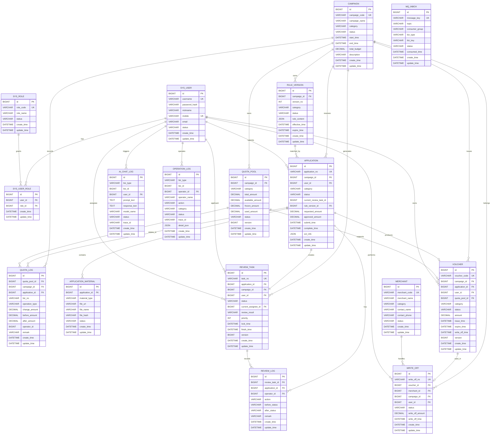
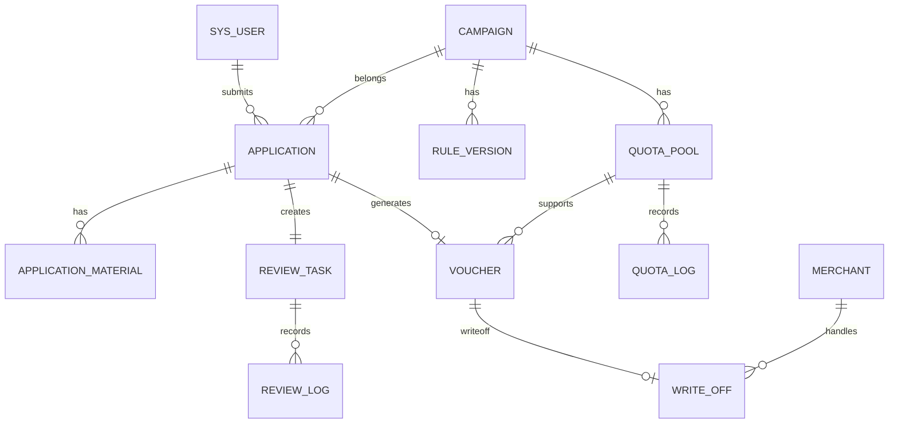

可以，下面我直接根据你这套表结构，给你整理一个 **ER 图（Mermaid 版）**，你可以直接复制到支持 Mermaid 的编辑器里查看，比如：

- Markdown 编辑器
    
- Typora
    
- Obsidian
    
- Mermaid Live Editor
    
- 部分 IDEA 插件
    

---

## ER 图（Mermaid）



---

## 这个 ER 图怎么理解

你这个库其实可以分成 **6 个模块**：

### 1. 权限模块

- `sys_user`
    
- `sys_role`
    
- `sys_user_role`
    

这是标准 RBAC。

---

### 2. 活动与规则模块

- `campaign`
    
- `rule_version`
    

一个活动可以有多个规则版本。

关系：

- `campaign 1 —— n rule_version`
    

---

### 3. 额度模块

- `quota_pool`
    
- `quota_log`
    

一个活动下可以有多个额度池；  
一个额度池对应很多额度变更日志。

关系：

- `campaign 1 —— n quota_pool`
    
- `quota_pool 1 —— n quota_log`
    

---

### 4. 申请审核模块

- `application`
    
- `application_material`
    
- `review_task`
    
- `review_log`
    

关系主线：

- 用户提交申请
    
- 申请上传材料
    
- 系统生成审核任务
    
- 审核过程产生审核日志
    

---

### 5. 券与核销模块

- `voucher`
    
- `merchant`
    
- `write_off`
    

关系主线：

- 申请通过后生成券
    
- 券在商户处核销
    
- 一张券最多对应一次核销
    

---

### 6. 日志与支撑模块

- `mq_inbox`
    
- `ai_chat_log`
    
- `operation_log`
    

这些是偏系统支撑的表。

---

## 你这套业务主链路

从业务角度，核心流程可以概括成：

```text
用户
 → 申请 application
 → 上传材料 application_material
 → 命中规则 rule_version
 → 进入审核任务 review_task
 → 产生审核日志 review_log
 → 审核通过后生成 voucher
 → 占用/变更 quota_pool 与 quota_log
 → 在 merchant 处 write_off 核销
```

---

## 我再给你一个“更适合答辩/PPT”的简化版 ER 主图

如果你觉得上面那个太复杂，答辩时可以用这个简化版：



这个版本更适合：

- 课程设计答辩
    
- 项目汇报 PPT
    
- 系统设计说明书
    

---

## 建议你下一步这样做

你这套表已经比较完整了，但我建议你再补 3 个东西：

### 1. 给状态字段做枚举说明

比如：

- `application.status`
    
- `review_task.status`
    
- `voucher.status`
    
- `write_off.status`
    

否则后面写代码容易混乱。

---

### 2. 补充逻辑外键说明

例如：

- `application.current_review_task_id` 现在没有外键约束
    
- 这属于“逻辑关联”，最好在设计文档里说明
    

---

### 3. 再出一张“业务流程图”

ER 图说明的是表关系，老师/面试官通常还会看：

- 用户申请流程图
    
- 审核流转图
    
- 发券核销流程图
    

这样你的“智焕项目”就更完整了。

---

如果你要，我下一条可以直接继续给你输出这 3 个中的任意一个：

1. **PlantUML 版 ER 图**
    
2. **适合论文/课程设计文档的数据库设计说明**
    
3. **申请→审核→发券→核销 的业务流程图**