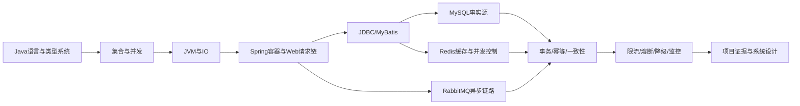

# Java 后端完整知识地图

> [!important] 定位
> 这是 Java 后端唯一主学习入口。目标不是背散乱八股，而是形成“语言与运行时 → 框架 → 数据与中间件 → 分布式与稳定性 → 项目证据”的完整能力链。

## 技术基线

- Java 主线按 Java 21 LTS 理解：语言基础、集合、JMM、并发包、JVM、虚拟线程。
- Spring 示例以 Spring Framework 6 / Spring Boot 3.x 的 Jakarta 体系为主。
- 数据访问以 JDBC、MyBatis 3、MySQL 8.0 为主。
- 工程能力覆盖 Redis、RabbitMQ、Linux、网络、Docker、Nginx、可观测性和 SmartRenew 项目。
- 面试回答必须区分：语言规范、JVM 实现、框架机制、项目实际实现、未来设计。

跨 OS/JVM 的并发与 IO 总图：[[操作系统面试精炼笔记/2026-08-30-OS并发IO与Java21虚拟线程知识总图]]。本目录保留 Java API 与工程选型，地址翻译、系统调用、epoll、Condition/CAS 因果链和虚拟线程调度以该专题为主解释。

## 按学习顺序进入

| 阶段 | 主笔记 | 学完必须能回答 |
|---|---|---|
| 1 | [[java八股文/Java后端完整知识体系/01-学习路线与大厂面试能力模型]] | Java 后端为什么要按这条顺序学 |
| 2 | [[java八股文/Java后端完整知识体系/02-Java语言基础与面向对象]] | 值传递、封装继承多态、接口与抽象类、不可变对象 |
| 3 | [[java八股文/Java后端完整知识体系/03-泛型异常反射注解与现代Java]] | 泛型擦除、异常边界、反射与注解、Lambda/Stream |
| 4 | [[java八股文/Java后端完整知识体系/04-集合框架与源码机制]] | List/Set/Map 选型、HashMap、ConcurrentHashMap |
| 4A | [[java八股文/Java后端完整知识体系/04A-数据结构算法与手写代码]] | 复杂度、数组链表树图、常用算法与手写代码 |
| 5 | [[java八股文/Java后端完整知识体系/05-JMM并发安全与锁]] | 可见性/原子性/有序性、happens-before、锁与 CAS |
| 6 | [[java八股文/Java后端完整知识体系/06-线程池异步编程与Java21虚拟线程]] | 线程池任务流、CompletableFuture、虚拟线程边界 |
| 7 | [[java八股文/Java后端完整知识体系/07-JVM内存类加载GC与调优]] | 对象如何创建、类如何加载、GC 如何判断与回收、OOM 怎么查 |
| 8 | [[java八股文/Java后端完整知识体系/08-IO-NIO网络与序列化]] | 阻塞/非阻塞、BIO/NIO、TCP 流、序列化风险 |
| 9 | [[java八股文/Java后端完整知识体系/09-Spring-IOC-Bean生命周期与Boot自动配置]] | IOC、Bean 生命周期、循环依赖、自动配置条件 |
| 10 | [[java八股文/Java后端完整知识体系/10-SpringMVC-AOP事务与Security]] | 请求链、代理失效、事务传播、鉴权与授权 |
| 11 | [[java八股文/Java后端完整知识体系/11-JDBC-MyBatis与数据库访问]] | JDBC 链路、Mapper 代理、缓存、批量与 N+1 |
| 11A | [[java八股文/Java后端完整知识体系/11A-Java工程规范测试构建与发布]] | Maven、测试体系、代码审查、CI/CD与灰度 |
| 12 | [[java八股文/Java后端完整知识体系/12-MySQL-Redis-RabbitMQ与数据一致性]] | 事务、缓存一致性、可靠消息、幂等与补偿 |
| 13 | [[java八股文/Java后端完整知识体系/13-分布式高并发稳定性与线上排障]] | 限流、熔断、降级、可观测性、故障定位 |
| 14 | [[java八股文/Java后端完整知识体系/14-SmartRenew项目与系统设计串联]] | 用项目证据回答技术选型与失败窗口 |
| 15 | [[java八股文/Java后端完整知识体系/15-大厂高频面试自测]] | 闭卷完成基础、原理、场景、排障和设计题 |

## 一张图串起 Java 后端

## 回答大厂面试题的统一模板

1. **一句话结论**：先回答是什么，不先讲历史。
2. **核心机制**：说明关键对象、状态和执行链。
3. **为什么这样设计**：说清性能、正确性、可维护性的取舍。
4. **场景与反例**：给 Java/Spring/SmartRenew 的真实例子。
5. **边界与排障**：说明什么时候失效、怎么观测和验证。

## 不要混淆的四层

| 层次 | 典型问题 | 回答边界 |
|---|---|---|
| Java 语言 | 重载、重写、泛型、异常、Lambda | 以语言语义为准 |
| JVM | 内存区、类加载、GC、JIT | 不把某个收集器实现说成语言规范 |
| 框架 | IOC、AOP、事务、自动配置 | 说明代理、容器和条件装配 |
| 分布式系统 | 缓存、消息、幂等、一致性 | 不宣称单个中间件解决全部正确性 |

## 旧笔记使用规则

- 本目录保存学习主线、标准答案、因果链和工程边界。
- 旧的 `Java后端面试精炼笔记`、`java笔记`、`java知识` 和 `_整理前归档` 暂作 Reference。
- 新主线验收前不删除旧文件；以后删除时先检查 Wiki 入链、图片、`.base` 和 `.canvas`。
