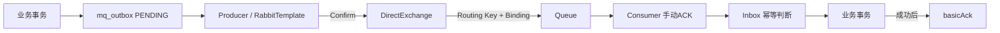

# RabbitMQ 面试知识地图

> [!summary] 复习总纲
> 先定位失败在哪一段，再说对应确认、重试和幂等。所有回答最后补一句风险边界。

## 1. 精炼笔记入口

| 顺序 | 专题 | 需要掌握 |
|---|---|---|
| 1 | [[01-主链与三类确认]] | Producer、Exchange、Routing Key、Binding、Queue、Consumer；Confirm、Return、Consumer ACK |
| 2 | [[02-重试、死信与幂等]] | Outbox 生产重试、Retry Queue、DLQ、Inbox、消息重投与业务重执行 |
| 3 | [[03-SmartRenew故障实验]] | 四个故障窗口、停 RabbitMQ 实验步骤、日志与表状态证据 |

项目关联：[[03-申请提交与Outbox-Inbox]] · [[04-额度预占与可靠发券]]

## 2. RabbitMQ 主链



核心职责：

- Exchange：接收消息并按照类型和绑定规则路由；
- Routing Key：生产者带给 Exchange 的消息标签；
- Binding：Exchange 到 Queue 的匹配规则；
- Queue：保存等待消费的消息；
- Consumer：从 Queue 获取并执行业务；
- Outbox：保存应该发送但可能还没有可靠发送成功的事件；
- Inbox：记录消费结果，降低重复投递造成的重复副作用。

## 3. 三类确认口诀

```text
Publisher Confirm：Broker 接收 publish 了吗？
Return：消息能路由到 Queue 吗？
Consumer ACK：这次 delivery 业务处理完了吗？
```

三者不能互相替代：Confirm 不等于路由成功，Return 不等于消费成功，ACK 不会替 RabbitMQ 检查 MySQL 事务。

## 4. 失败定位口诀

```text
Broker 未接收       → Outbox 保留 → 生产端重发
Exchange 无法路由   → mandatory + Return → 修路由或重试
消费业务失败        → Retry Queue 延迟重试 → 超限进 DLQ
业务提交后ACK前宕机 → RabbitMQ 可能重投 → Inbox/状态机幂等
```

最重要的区分：

> **生产失败补“消息发送”，消费失败补“业务处理”；消息可以重投，业务不能乱重做。**

## 5. 当前项目关键配置

| 配置 | 当前值 | 说明 |
|---|---|---|
| 主 Exchange | `smartrenew.review.exchange` | DirectExchange，持久化 |
| 主 Routing Key | `application.submitted` | 申请已提交事件 |
| 主 Queue | `smartrenew.review.queue` | 审核消费者监听 |
| Retry Exchange/Queue | `smartrenew.review.retry.exchange` / `.retry.queue` | 失败消息延迟回主链 |
| Dead Exchange/Queue | `smartrenew.review.dead.exchange` / `.dead.queue` | 超限失败隔离 |
| Confirm | `publisher-confirm-type: correlated` | 通过 `CorrelationData` 关联 Outbox ID |
| Return | `publisher-returns: true` + `mandatory: true` | 发现不可路由消息 |
| Consumer ACK | `acknowledge-mode: manual` | 业务成功后手动确认 |
| Retry delay | `PT15S` | Retry Queue TTL 约 15 秒 |
| Max retry | `3` | 超过后进入死信链 |
| Prefetch | `10` | 每个消费者的未确认消息上限配置 |
| Outbox 扫描 | `PT15S`、batch `20` | 扫描待发送和租约过期记录 |
| Outbox lease | `PT30S` | 防止发送任务长期占用 |

## 6. 面试边界

- Confirm ACK 只说明 Broker 已接受 publish；在 `mandatory=true` 时，不可路由消息仍可能伴随 Return。
- 没有 Return 只表示本次 mandatory publish 未收到不可路由退回，不能替代 Consumer ACK。
- 手动 ACK 也不保证业务成功，代码必须先完成业务事务，再 ACK。
- RabbitMQ 的至少一次语义意味着可能重复投递，Inbox 和业务状态机必须幂等。
- Outbox、Inbox、业务事务和 ACK 通常不在一个跨系统原子事务内，必须明确剩余窗口。
- DLQ 是隔离区，不是自动修复；当前项目已配置死信链，但不能说已实现完整人工重放平台。
- “已实现”“代码设计”“本次实验验证”是三种不同结论，汇报时必须分开。

## 7. 90 秒答题顺序

```text
1. 先画 Outbox → Producer → Exchange → Queue → Consumer → 业务/Inbox → ACK
2. 再拆 Confirm / Return / ACK 各自证明的边界
3. 按生产失败和消费失败分别说重试
4. 最后说 Inbox、状态机、唯一约束和尚未消除的故障窗口
```

