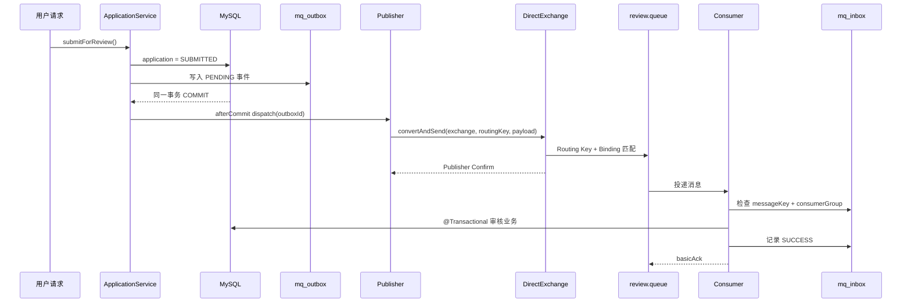

# RabbitMQ 主链与三类确认

[[00-RabbitMQ面试知识地图|知识地图]] · [[02-重试、死信与幂等|下一篇：重试与幂等]]

## 1. 四个核心对象

| 对象 | 负责什么 | SmartRenew 当前值 |
|---|---|---|
| Exchange | 接收 Producer publish，并根据规则分发 | `smartrenew.review.exchange` |
| Routing Key | 消息携带的路由标签 | `application.submitted` |
| Binding | Exchange 与 Queue 之间的匹配规则 | 主 Queue 绑定同名 key |
| Queue | 保存等待消费的消息 | `smartrenew.review.queue` |

Producer 通常不是直接发 Queue，而是发送：

```text
Exchange + Routing Key + Message Body
```

### DirectExchange 规则

DirectExchange 要求消息 Routing Key 与 Binding Key 精确匹配：

```text
application.submitted == application.submitted  → 路由到主 Queue
application.cancelled != application.submitted  → 无匹配 Queue
```

## 2. SmartRenew 正常业务链



### 2.1 生产端项目证据

入口：`ApplicationServiceImpl.submitForReview()`。

申请提交时：

```text
application.status = SUBMITTED
→ ApplicationSubmittedEventPublisher.recordSubmittedEvent(applicationId)
→ mq_outbox 保存 eventKey、bizKey、exchange、routingKey、payload、PENDING
```

业务方法带 `@Transactional`，所以正常情况下申请状态和 Outbox 记录一起提交。`recordSubmittedEvent()` 检测到事务后注册 `afterCommit()`，避免数据库事务尚未提交时消息已经被消费者处理。

注意：如果调用时没有活动事务，当前代码会直接 `dispatch()`；面试只需说明主业务路径有事务，别把“所有调用场景都一定 afterCommit”说成绝对结论。

### 2.2 真实发送代码证据

```java
rabbitTemplate.convertAndSend(
    outbox.getExchangeName(),
    outbox.getRoutingKey(),
    outbox.getPayloadJson(),
    message -> decorateMessage(message, outbox),
    new CorrelationData(String.valueOf(outboxId))
);
```

当前 `decorateMessage()` 还设置了：

- `messageId = outbox.eventKey`；
- `x-outbox-id`、`x-event-type`、`x-retry-count` 头。

## 3. Publisher Confirm

项目配置：

```yaml
spring:
  rabbitmq:
    publisher-confirm-type: correlated
```

发送后通过 `CorrelationData` 关联 Outbox ID，并等待确认 Future，当前等待上限为 5 秒。

Confirm ACK 的准确含义：

> RabbitMQ Broker 已接受这次 publish；对于可路由的消息，Broker 已完成相应的接收处理。

Confirm 没有证明：

- 没有单独证明消费者已经收到；
- 没有证明消费者业务事务成功；
- 没有替代数据库 Outbox、Inbox 和业务幂等；
- 在未使用 mandatory/Return 的语境下，不能仅凭 Confirm 推断消息一定进入某个 Queue。

不可路由消息的细节：在 `mandatory=true` 时，Broker 判断没有 Queue 可以接收后，会发送 `basic.return`；发布确认可能随后仍然到达。因此不能只看到 Confirm ACK 就把 Outbox 标记为 SENT。

## 4. Return

项目配置：

```yaml
spring:
  rabbitmq:
    publisher-returns: true
    template:
      mandatory: true
```

Return 的含义：

> Broker 已收到 publish，但根据 Exchange、Routing Key 和 Binding 找不到可投递的 Queue，于是把消息退回 Producer。

典型场景：

```text
Exchange 存在 ✅
Routing Key = application.abc
Binding Key = application.submitted
没有精确匹配 ❌
→ Return
```

当前 Publisher 的成功条件是：

```java
if (confirm.isAck() && correlationData.getReturned() == null) {
    mqOutboxService.markSent(outboxId, leaseUntil);
}
```

也就是：

```text
Confirm ACK + 没有 Return → Outbox = SENT
Confirm NACK 或 Return    → 调度生产重试
发送异常/超时             → 调度生产重试
```

Return 没有证明：

- 消费者是否读取；
- 业务是否提交；
- Inbox 是否写入成功。

## 5. Consumer ACK

项目 Listener 使用：

```yaml
spring.rabbitmq.listener.simple.acknowledge-mode: manual
```

核心调用：

```java
channel.basicAck(deliveryTag, false);
```

它表示：

> Consumer 告诉 Broker，这次 delivery 已处理完，可以不再按未确认消息重新投递。

正确顺序：

```text
收到消息
→ 查 Inbox
→ 执行 @Transactional 业务
→ 业务事务提交
→ 写 Inbox SUCCESS
→ basicAck
```

错误顺序：

```text
收到消息
→ 先 ACK
→ MySQL 业务失败
→ 消息已被确认，可能永久失去重试机会
```

ACK 自身不会访问 MySQL 验证 `application`、`review_task` 或 Inbox 是否真的成功。业务正确性来自代码顺序、事务、状态校验、唯一约束和幂等设计。

## 6. 三类确认对比表

| 机制 | 方向 | 能证明 | 不能证明 |
|---|---|---|---|
| Publisher Confirm | Broker → Producer | Broker 接收 publish | 不等于 Queue 已消费、业务成功 |
| Return | Broker → Producer | mandatory publish 无法路由到 Queue | 不等于消费失败或业务失败 |
| Consumer ACK | Consumer → Broker | 这次 delivery 已处理，Broker 可停止重投 | 不会验证数据库事务 |

口诀：

> **Confirm：到没到 Broker？Return：进没进 Queue？ACK：Consumer 说处理完没？**

## 7. SmartRenew 消费证据

Consumer 类：`ApplicationSubmittedEventConsumer`。

业务类：`ApplicationReviewPipelineServiceImpl.processSubmittedApplication()`，带 `@Transactional`，可能：

- 推进申请状态；
- 创建人工审核任务；
- 自动批准或拒绝；
- 对批准结果触发后续额度处理。

Inbox 判重键：

```text
messageKey = event.eventId()
consumerGroup = review-center
```

重复消息路径：

```text
alreadyConsumed = true
→ 跳过审核业务
→ basicAck
```

## 8. 当前实现边界

- Publisher 主发送明确等待 Confirm，并检查 Return；Consumer 转发 Retry/DLQ 的 `convertAndSend` 当前没有像主发送一样显式等待 CorrelationData Confirm，需要实验或后续增强时单独验证。
- 业务事务提交、Inbox 记录和 ACK 不是一个跨系统原子事务；如果业务提交后、Inbox 写入前宕机，重复消息可能再次进入业务方法，当前主要依赖 Inbox、申请状态和数据库约束降低影响。
- “没有 Return”只说明本次 mandatory publish 未收到不可路由退回，不等同于消费者业务成功。
- 不应把 Confirm、Return、ACK 统称为“消息已经完整处理”。

## 9. 60 秒面试回答

> SmartRenew 的正常链路是申请提交时先在同一数据库事务中把申请状态改为 SUBMITTED，并写入 mq_outbox；事务提交后通过 afterCommit 发送 RabbitMQ。Producer 发到 DirectExchange，Exchange 根据 Routing Key 和 Binding 精确路由到审核 Queue，Consumer 再手动 ACK。生产端开启 Correlated Publisher Confirm 和 mandatory Return，只有 Confirm ACK 且没有 Return 才把 Outbox 标记为 SENT；这只能证明 Broker 接收和没有发现不可路由，不能证明消费者业务成功。消费端先查 Inbox，再执行审核事务，业务成功后记录 Inbox 并 basicAck。ACK 也不验证 MySQL，所以最终还依赖事务、状态机、唯一约束和幂等边界。

