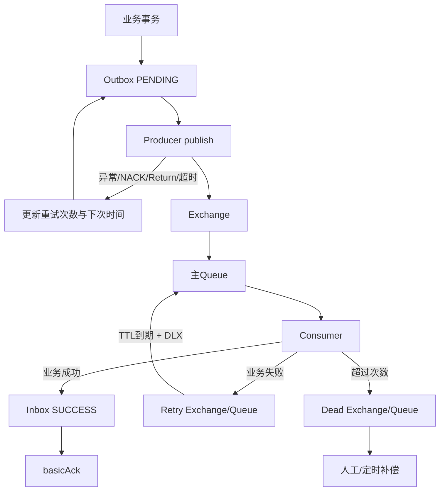

# RabbitMQ 重试、死信与幂等

[[01-主链与三类确认|上一篇：主链与确认]] · [[00-RabbitMQ面试知识地图|知识地图]] · [[03-SmartRenew故障实验|下一篇：故障实验]]

## 1. 先定位失败在哪一段

```text
业务提交 → Outbox → Producer → Exchange → Queue → Consumer → 业务处理
```

重试不是一个笼统按钮，要先回答：

1. 失败发生在生产端还是消费端？
2. 这次重试是重新发送消息，还是重新执行业务？
3. 谁负责重试，重试次数和退避是什么？
4. 超过上限后如何隔离、告警和补偿？

## 2. 生产端：Outbox 重发

### 2.1 为什么需要 Outbox

没有 Outbox：

```text
application → SUBMITTED ✅
准备发 RabbitMQ
进程宕机 / Broker 不可用 ❌
审核消息永久缺失
```

SmartRenew 在同一个数据库事务中写入：

```text
application.status = SUBMITTED
mq_outbox.status = PENDING
```

因此 Broker 暂时不可用时，数据库仍保存发送依据。

Outbox 保证的是：

> 失败后有依据重新发送，倾向于至少一次发送；不是“只发送一次”。

### 2.2 当前状态机与扫描

发送前通过条件更新把记录变为 `SENDING`，并设置约 30 秒租约；发送成功后要求状态和租约仍匹配，再变为 `SENT`。

定时任务约每 15 秒扫描：

- `PENDING` 且到达 `nextRetryTime` 的记录；
- `SENDING` 但租约已经过期的记录。

发送异常、Confirm NACK、Return 或等待超时会增加 `retryCount` 并设置下一次重试时间。超过 `maxRetryCount=3` 后状态变为 `FAILED`。

重要边界：当前扫描不会自动捞回 `FAILED`。因此：

```text
短暂 Broker 故障 → 自动恢复可能成功
持续故障直到 FAILED → 恢复 Broker 后仍需人工或补偿任务重新处理
```

### 2.3 生产重试重试的是什么

```text
重新执行 Producer → Broker
```

不是重新执行：

```text
用户提交申请
```

业务已经成功落库，重试的是消息发送动作。

## 3. 消费端：延迟重试

消费失败场景：

```text
Exchange → Queue → Consumer 收到
Consumer 执行业务 → MySQL/规则/代码异常
```

SmartRenew 当前不是简单 `NACK + requeue=true` 原地高速重试，而是应用层转发：

```text
主 Queue
→ Consumer 业务失败
→ Retry Exchange
→ Retry Queue（TTL 约15秒）
→ 消息过期后 Dead Letter 到主 Exchange
→ 主 Queue
→ Consumer 再处理
```

当前配置：

```yaml
retry-delay: PT15S
max-retry-count: 3
```

延迟重试的价值：下游短暂故障时给数据库、外部服务和连接池恢复时间，避免几十毫秒内反复轰炸故障依赖。

边界：延迟太短仍可能加压，太长会增加用户等待；永久业务 Bug、坏消息和缺失数据不会因为无限重试而自动修好。

## 4. 死信队列 DLQ

超过最大消费重试次数后：

```text
Consumer
→ Dead Exchange
→ Dead Queue
```

当前项目：

```text
smartrenew.review.dead.exchange
    ↓ application.submitted.dead
smartrenew.review.dead.queue
```

DLQ 的正确定位：

> 隔离毒消息和持续失败消息，让正常消费链继续工作；它不是自动修复机制。

后续处理：

- 人工查看错误、修复数据或代码后重新投递；
- 定时补偿扫描异常任务、失败记录或其他可恢复状态；
- 记录告警、失败原因、消息 ID 和业务 ID，避免只看到“队列有消息”。

除非真的实现了后台重放平台，否则不要说项目已经具备完整人工重放能力。当前项目明确实现的是 Outbox 定时补发；DLQ 主要完成隔离链路。

## 5. basicNack、重投与应用层转发的区别

### Broker 重新投递

```text
Consumer 没 ACK / basicNack(requeue=true)
→ Broker 认为 delivery 未完成
→ 连接恢复或重新调度后再次投递原消息
```

### 应用层 Retry Queue

```text
Consumer 捕获业务异常
→ 发布一条带 retryCount 的新消息到 Retry Exchange
→ 对原 delivery basicAck
→ Retry Queue TTL 到期
→ 通过 DLX 回主 Exchange
```

当前 SmartRenew 的消费失败主要走第二种；只有转发 Retry/DLQ 过程本身异常时，代码才 `basicNack(..., true)` 让原消息重新入队。

两者不是同一机制，排查日志时要看：

- 是原 delivery redelivered；
- 还是产生了新的 retry publish；
- `x-retry-count` 是否递增；
- 原消息是否已经被 ACK。

## 6. 消息重新投递 ≠ 业务重新执行

四种情况：

| 场景 | 消息重新投递 | 业务重新执行 |
|---|---:|---:|
| 第一次正常成功 | 否 | 一次 |
| 业务失败后重试 | 是 | 是，期望再次尝试 |
| 业务成功但 ACK 前宕机 | 是 | 理想情况下不再执行 |
| 已成功消息被重复发送 | 是 | 理想情况下不再执行 |

理想目标：

```text
消息允许至少一次到达
业务副作用必须幂等
```

## 7. Inbox 消费幂等

Consumer 使用：

```text
messageKey = event.eventId()
consumerGroup = review-center
```

处理逻辑：

```text
收到消息
→ 查询 mq_inbox(messageKey, consumerGroup)
→ 已成功/已最终失败：跳过业务，直接 ACK
→ 未处理：执行业务事务
→ 记录 Inbox SUCCESS
→ basicAck
```

消息成功但 ACK 丢失时：

```text
业务事务 COMMIT
→ 进程在 ACK 前宕机
→ RabbitMQ 认为未确认，可能重投
→ Inbox 已有 SUCCESS
→ 跳过业务，直接 ACK
```

## 8. 当前 Inbox 的实现边界

当前代码中，审核业务事务、Inbox 记录和 ACK 不是跨系统原子操作：

```text
审核业务 COMMIT
→ Inbox SUCCESS 写入前宕机
→ 重投
→ Inbox 查不到 SUCCESS
→ 可能再次进入业务方法
```

当前的其他防线：

- Application 状态已经推进时跳过重复审核；
- 业务状态机限制可执行的状态转换；
- 数据库唯一约束和条件更新防止重复记录或错误覆盖。

更严格的改进方向：在同一数据库事务中以唯一键插入 Inbox 占位、执行业务并标记 SUCCESS，再 ACK；但如果当前代码没有这样实现，只能作为改进方案，不可冒充现状。

## 9. 失败处理全景图



## 10. 60 秒面试回答

> 我会先区分生产端和消费端。生产端用 Outbox 把业务状态和待发送事件放在同一个数据库事务中，事务提交后发送 RabbitMQ；发送失败时 Outbox 保留 PENDING 或进入下一次重试时间，由定时任务重发。消费端收到消息后先查 Inbox，再执行业务事务；业务失败不立即无限重试，而是转发到带 TTL 的 Retry Queue，延迟后回到主队列，超过次数进入 DLQ 隔离。RabbitMQ 采用至少一次语义，消息可能重复投递，所以必须区分“消息重投”和“业务重执行”，通过 Inbox、状态机和唯一约束避免重复副作用。当前实现仍有业务提交、Inbox 写入和 ACK 之间的故障窗口，需要明确说出边界。

## 11. 高频自测

1. Outbox 解决什么问题，为什么仍可能重复发送？
2. 当前项目为什么只扫描 PENDING 和租约过期的 SENDING？FAILED 恢复有什么边界？
3. 为什么消费失败不建议无限立即重试？
4. Retry Queue 的 TTL 和 DLX 分别起什么作用？
5. DLQ 是修复机制还是隔离机制？
6. `basicNack(requeue=true)` 与发布到 Retry Queue 有什么区别？
7. 业务成功但 ACK 前宕机时，消息和业务分别会怎样？
8. Inbox 的 messageKey 和 consumerGroup 为什么要一起参与幂等判断？

