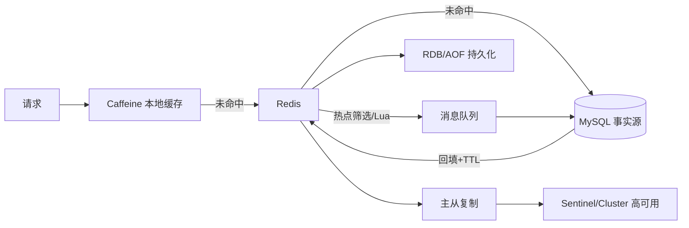

# Redis 面试知识地图

> [!summary] 复习顺序
> 先说场景与结论，再说机制、命令或代码证据，最后主动交代风险边界。

## 1. 精炼笔记入口

| 顺序 | 专题 | 必须掌握 |
|---|---|---|
| 1 | [[01-缓存与分布式锁]] | Cache Aside、穿透/击穿/雪崩、一致性、TTL、锁、额度预占 |
| 2 | [[02-数据结构与场景选型]] | String、Hash、List、Set、ZSet；Bitmap、Bitfield、GEO、HyperLogLog、Stream |
| 3 | [[03-持久化、复制与高可用]] | RDB、AOF、复制、Sentinel、故障与数据丢失窗口 |
| 4 | [[04-Lua原子操作与多级缓存]] | Lua 原子边界、Cluster Key、多级缓存、并发漏斗 |

项目证据：[[04-额度预占与可靠发券]] · [[03-申请提交与Outbox-Inbox]]

## 2. 一张图串起 Redis

这张图只表达职责关系，不表示所有操作处于同一个事务。Redis、MQ 与 MySQL 之间仍存在失败窗口，需要事务、唯一约束、幂等、补偿、对账和告警共同兜底。

## 3. 场景选型速查

| 需求 | 首选思路 | 不应忽略 |
|---|---|---|
| 热点对象读取 | Cache Aside + TTL | 双写窗口、删除失败、击穿 |
| 不存在 Key 攻击 | 空值/布隆 + 校验限流 | 空值一致性、布隆假阳性 |
| 热点 Key 过期 | 互斥重建/逻辑过期 | 等待延迟、旧值取舍 |
| 大量 Key 同时过期 | 随机 TTL + 限流降级 | Redis 整体故障仍需高可用 |
| 跨节点互斥 | `SET NX PX` + 唯一值 + Lua 释放 | 超时、续期、主从切换、数据库兜底 |
| 经纬度附近搜索 | GEO | 不是完整 GIS，不等于道路距离 |
| 海量 UV 近似计数 | HyperLogLog | 近似值，不能查询成员 |
| Redis 内部消息流 | Stream + Consumer Group | PEL、ACK、重投与幂等、容量裁剪 |
| 数据恢复 | RDB/AOF | 性能、恢复速度与数据丢失窗口取舍 |
| Redis 主节点故障 | Replica + Sentinel/Cluster | 异步复制仍可能丢最近写入 |
| 单 JVM 超热点 | Caffeine + Redis | 本地多副本不一致和堆内存压力 |

## 4. 面试中不要说的绝对话

- 不说“Redis 决定最终胜者”：Redis 可以预筛选，最终业务正确性仍由数据库条件更新、事务和唯一约束兜底。
- 不说“用了 Redis 锁就绝对不会并发”：业务超时、暂停、续期失败和主从切换都可能破坏互斥。
- 不说“主从复制保证不丢数据”：复制通常是异步的，故障切换存在最近写入丢失窗口。
- 不说“Stream ACK 后消息被删除”：`XACK` 是把消息从消费者组的 PEL 移除，消息本体仍在 Stream 中，需另行裁剪。
- 不说“Consumer Group 保证业务不重复”：未 ACK 消息可以重投，业务必须幂等。
- 不说“Lua 像数据库事务一样失败自动回滚”：Lua 保证执行期间不被其他命令插入，但脚本错误不等同于数据库事务回滚。
- 不背“提升几十倍、拦截 99%、几百万线程”等未经可复现实验的数据。

## 5. 原始笔记索引（保留不删除）

| 原始笔记 | 已整理到 |
|---|---|
| [[分布式锁]] | [[01-缓存与分布式锁]] |
| [[lua]] | [[01-缓存与分布式锁]]、[[04-Lua原子操作与多级缓存]] |
| [[Caffeine]] | [[04-Lua原子操作与多级缓存]] |
| [[Geospatial]] | [[02-数据结构与场景选型]] |
| [[hyperloglog]] | [[02-数据结构与场景选型]] |
| [[Stream消息队列]] | [[02-数据结构与场景选型]] |
| [[redis持久化]] | [[03-持久化、复制与高可用]] |
| [[主从复制]] | [[03-持久化、复制与高可用]] |
| [[高并发心得]] | [[04-Lua原子操作与多级缓存]]中的边界化版本 |

## 6. 十分钟复习法

1. 2 分钟：背 Cache Aside 和三类缓存问题的触发条件。
2. 2 分钟：背 `SET NX PX + 唯一值 + Lua compare-and-delete`。
3. 2 分钟：口述 String、Hash、List、Set、ZSet 的特点和一个边界。
4. 2 分钟：比较 RDB/AOF，并说出异步复制的数据丢失窗口。
5. 2 分钟：解释 Stream 的 PEL、ACK、重投和业务幂等；再快速过一遍 GEO、HyperLogLog 与 Caffeine。
