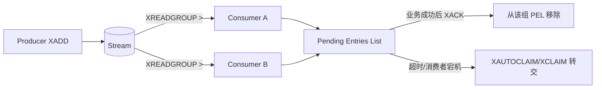

# Redis 数据结构与场景选型

[[01-缓存与分布式锁|上一篇：缓存与锁]] · [[00-Redis面试知识地图|知识地图]] · [[03-持久化、复制与高可用|下一篇：持久化与高可用]]

## 1. 五种基本数据结构

最短记忆：

```text
String：缓存、计数、锁
Hash：对象字段
List：有序列表、简单队列
Set：去重、集合运算
ZSet：按score排序、排行榜
```

| 数据结构 | 核心特点 | 代表命令 | 常见用途 |
|---|---|---|---|
| String | 字节序列，也可按整数或浮点数操作 | `SET`、`GET`、`MGET`、`INCR` | 缓存、计数器、限流计数、锁值 |
| Hash | 一个 Key 下保存多个 field-value | `HSET`、`HGET`、`HMGET`、`HINCRBY` | 用户信息、对象缓存、字段计数 |
| List | 有顺序、可重复，可从两端操作 | `LPUSH`、`RPUSH`、`LPOP`、`RPOP`、`BLPOP` | 最新列表、栈、简单队列 |
| Set | 无序、元素唯一 | `SADD`、`SISMEMBER`、`SINTER`、`SUNION`、`SDIFF` | 去重、标签、共同好友/关注 |
| Sorted Set（ZSet） | 成员唯一；每个成员有 score 并按其排序 | `ZADD`、`ZRANGE`、`ZRANK`、`ZINCRBY` | 排行榜、热度、优先级队列 |

### 1.1 String

String 是最基础的数据类型，Value 是二进制安全的字节序列；数字本质上也以 String 保存，但可以用原子数字命令操作。

```redis
SET user:1:name "李宇"
GET user:1:name

SET page:view:1001 10
INCR page:view:1001

SET lock:order:1001 request-uuid NX PX 30000
```

适合：对象整体序列化缓存、计数器、验证码、限流计数和分布式锁的锁 Key。

边界：

- `INCR` 等单条命令是原子的，但多条命令组成的业务判断仍需 Lua、事务或其他并发控制；
- 分布式锁不能只说“用 String”，还必须说明 `SET NX PX`、唯一所有者值、Lua 校验释放及主从切换边界；
- 不要把很大的对象都序列化成一个 Value，否则网络传输、序列化和热点 Key 风险都会增加。

### 1.2 Hash

Hash 类似 `Map<String, String>`，适合在一个 Redis Key 中保存对象的多个字段。

```redis
HSET user:1 name Tom age 20 city Qingdao
HGET user:1 name
HMGET user:1 name age
HINCRBY user:1 loginCount 1
```

与整个对象存为 String 相比，Hash 可以单独读取或修改字段；但对象结构复杂、字段需要不同序列化方式时，维护成本也会增加。

边界：大 Hash 不要直接频繁 `HGETALL`，否则会产生较大的 CPU、网络和客户端内存开销，可按字段读取或使用 `HSCAN` 渐进遍历。TTL 能力还要结合 Redis 版本判断：传统设计通常以整个 Hash Key 为过期单位，不应默认所有环境都支持字段级 TTL。

### 1.3 List

List 保存有序且可重复的元素，可以从左右两端插入和弹出。

```redis
LPUSH activity:latest item-1
LPUSH activity:latest item-2
LRANGE activity:latest 0 9

RPUSH task:queue task-A task-B
BLPOP task:queue 5
```

适合：最新动态列表、栈、简单生产者消费者队列。

边界：List 本身没有消费者组、PEL 和完善的确认/重领机制。如果任务取出后消费者宕机，简单 `LPOP/BLPOP` 方案可能丢失处理机会；要求确认、恢复和多消费者组时优先评估 Stream 或专业消息中间件。按索引访问 List 中间位置通常也不是其优势。

### 1.4 Set

Set 保存无序且不重复的成员，擅长成员判断和集合运算。

```redis
SADD user:1:tags Java Redis MySQL
SISMEMBER user:1:tags Redis

SINTER user:1:follows user:2:follows
SUNION team:a:members team:b:members
SDIFF user:1:follows user:2:follows
```

适合：去重、标签、点赞用户集合、共同好友/共同关注。

边界：对超大 Set 做交集、并集或差集可能消耗较多 CPU 和内存，线上使用要控制集合规模并压测；遍历大 Set 应优先使用 `SSCAN`，避免一次返回全部成员。

### 1.5 Sorted Set（ZSet）

ZSet 的成员不重复，每个成员关联一个 score，并按 score 排序；score 相同时再按成员的字典序确定顺序。

```redis
ZADD game:rank 90 zhangsan 100 lisi 80 wangwu
ZRANGE game:rank 0 -1 REV WITHSCORES
ZRANK game:rank lisi
ZINCRBY game:rank 5 zhangsan
```

适合：排行榜、热度排序、优先级任务、按时间戳组织的延迟任务候选集合。

边界：ZSet 只负责按 score 存储和排序。用它做延迟任务时，还要解决多个消费者竞争、任务取出原子性、重复执行、失败重试和持久化边界，不能把 `score=执行时间` 当成完整消息系统。

### 1.6 五种结构的 60 秒回答

> Redis 最核心的五种数据结构是 String、Hash、List、Set 和 Sorted Set。String 保存字符串或数字，适合缓存、原子计数以及配合 SET NX PX 实现锁；Hash 在一个 Key 下保存多个字段，适合对象缓存；List 有序且可重复，能从两端操作，适合列表、栈和简单队列；Set 无序且去重，支持交并差集，适合标签和共同关注；ZSet 在唯一成员上增加 score 排序，最典型是排行榜。选型时还要考虑大 Key、阻塞命令和可靠性边界，例如 List 做简单队列没有 Stream 的消费者组、PEL 和 ACK 机制。

## 2. 扩展结构与选型原则

不要先背命令再找场景，应先明确业务是否要求精确、是否需要保存成员、是否需要消费确认，以及数据量和过期策略。

| 需求 | 结构 | 关键边界 |
|---|---|---|
| 附近的人、门店距离 | GEO | 经纬度搜索，不是道路导航或完整 GIS |
| 海量 UV 去重数量 | HyperLogLog | 近似统计，不能取回成员 |
| 精确去重且需成员列表 | Set | 内存随成员数量增长 |
| 大量二值状态 | Bitmap | 适合连续或可映射 ID，不能替代任意成员集合 |
| 一段 String 内打包多个小整数 | Bitfield | 位宽、偏移和溢出策略更复杂 |
| 追加日志、消费组 | Stream | 至少一次倾向、重复消费、PEL 与裁剪 |

### 2.1 Bitmap 与 Bitfield

Bitmap 不是独立底层类型，而是把 String 当作位数组操作。它适合签到、在线状态、是否完成等大量二值标记。

```redis
SETBIT sign:user:1:202608 26 1
GETBIT sign:user:1:202608 26
BITCOUNT sign:user:1:202608
```

Bitfield 同样操作 String，但可以在指定偏移处读取、写入或增加带符号/无符号的小整数，并设置溢出行为：

```redis
BITFIELD player:1 \
  SET u8 0 120 \
  INCRBY u8 0 5 \
  GET u8 0
```

`OVERFLOW WRAP/SAT/FAIL` 分别表示环绕、饱和截断和失败。使用前必须设计清楚位宽和偏移，否则字段容易相互覆盖；稀疏且偏移极大的 Bitmap 也可能造成意外内存占用。

## 3. GEO 地理空间

GEO 用于存储经纬度、计算两点球面距离和查找一定范围内的成员。底层编码和存储与 Sorted Set 相关，因此在 Redis Insight 中通常会看到 ZSET 表现。

### 3.1 核心命令

```redis
# 注意顺序：经度在前，纬度在后
GEOADD china:city 116.40 39.90 beijing
GEOADD china:city 121.47 31.23 shanghai
GEOADD china:city 118.79 32.06 nanjing

GEODIST china:city beijing shanghai km

GEOSEARCH china:city \
  FROMLONLAT 120.6 31.3 \
  BYRADIUS 200 km \
  WITHDIST ASC
```

### 3.2 适用与边界

适合附近门店、车辆、用户等粗粒度地理检索。它计算的是基于坐标的距离，不考虑道路、交通、行政区划和复杂空间关系；需要路线规划、多边形相交等能力时应使用专业 GIS。

位置频繁更新时还要考虑写入压力、历史轨迹是否需要单独存储，以及用户位置隐私。

### 3.3 30 秒回答

> Redis GEO 适合存经纬度、计算距离和查询附近成员，常用 GEOADD、GEODIST 和 GEOSEARCH。它适合门店或车辆的附近搜索，但不是完整 GIS，不能直接承担道路导航、复杂空间关系和历史轨迹分析。

## 4. HyperLogLog 基数统计

HyperLogLog 用极小且有上界的空间估算去重数量，Redis 文档常用约 `0.81%` 的标准误差描述其精度，单个结构最大约占 12 KB。它保存的是估算所需状态，不保存可遍历的原始成员。

### 4.1 核心命令

```redis
PFADD site:uv:20260827 user_A user_B user_C
PFADD site:uv:20260827 user_A user_D
PFCOUNT site:uv:20260827

PFADD site:uv:20260826 user_A user_E
PFMERGE site:uv:two-days site:uv:20260826 site:uv:20260827
PFCOUNT site:uv:two-days
```

### 4.2 选择 Set、Bitmap 还是 HyperLogLog

| 要求 | 选择 |
|---|---|
| 必须得到精确数量并查看成员 | Set |
| 用户 ID 可映射为紧凑整数，只需签到/是否访问等状态 | Bitmap |
| 数据极大，只需近似去重数量 | HyperLogLog |

不要用 HyperLogLog 判断“某个用户是否访问过”，因为它不能查询成员是否存在，也不能取回成员列表。

### 4.3 30 秒回答

> HyperLogLog 用于海量数据的近似基数统计，例如日 UV。它占用空间小，常用 PFADD、PFCOUNT 和 PFMERGE，但结果存在约 0.81% 的标准误差，而且不能取回成员或判断某个成员是否加入过；要求精确或需要成员明细时应选 Set 或其他结构。

## 5. Stream 与 Consumer Group

Stream 是按 ID 有序追加的消息日志。生产者通过 `XADD` 写入；消费者可以独立读取，也可以加入 Consumer Group 分摊同一组的消息。



### 5.1 核心流程

```redis
XADD order:stream * orderId 1001 userId 88

XGROUP CREATE order:stream order-workers 0 MKSTREAM

XREADGROUP GROUP order-workers worker-1 COUNT 10 BLOCK 2000 \
  STREAMS order:stream >

XPENDING order:stream order-workers

XACK order:stream order-workers <message-id>
```

- `>` 表示读取尚未交付给本组其他消费者的新消息；
- 消息交付后进入该消费者组的 PEL；
- 业务成功后执行 `XACK`，消息从该组的 PEL 移除；
- `XACK` 不会自动删除 Stream 中的消息本体；
- 长时间未确认的消息可通过 `XAUTOCLAIM` 或 `XCLAIM` 转交给其他消费者处理。

### 5.2 可靠性边界

- 消费者业务提交后、ACK 前宕机，消息会再次交付，因此业务必须用消息 ID 或业务唯一键幂等。
- 先 ACK 后提交业务可能丢失业务执行机会；通常应在业务成功后 ACK。
- 未确认不等于永不丢失，还要考虑 Redis 持久化、复制切换、错误裁剪和运维操作。
- Stream 会持续增长，应使用明确的保留策略和 `MAXLEN`/`XTRIM`，并理解裁剪与未确认消息的关系；不同 Redis 版本支持的裁剪选项不同。
- Consumer Group 负责组内分工，不保证“业务只执行一次”。工程上通常按至少一次投递思路设计。

### 5.3 与 RabbitMQ 的选择

Stream 适合系统已依赖 Redis、规模和路由需求相对简单、希望使用追加日志和消费组的场景。需要复杂路由、成熟死信/重试生态、独立消息基础设施和更强运维隔离时，通常优先考虑 RabbitMQ、Kafka 等专业消息系统。

### 5.4 60 秒回答

> Redis Stream 是带有有序消息 ID 的追加日志。生产者用 XADD 写入，消费者组用 XREADGROUP 分摊消息；消息交付后进入 PEL，业务成功再 XACK，ACK 只是从该组 PEL 移除，不会删除消息本体。消费者在业务提交后、ACK 前宕机会导致重新投递，因此业务必须幂等；同时还要处理 Pending 消息转交、Stream 裁剪、持久化和故障切换边界，不能说 Consumer Group 天然保证不重复、不丢失。

## 6. 高频自测

1. String、Hash、List、Set、ZSet 的特点和典型用途分别是什么？
2. String 原子计数为什么不等于多步骤业务原子？
3. 大 Hash 为什么不建议直接频繁执行 `HGETALL`？
4. List 做消息队列与 Stream 相比缺少哪些可靠性机制？
5. Set 的交并差集在大集合上有什么风险？
6. ZSet 做排行榜和延迟任务分别如何使用 score？
7. Bitmap 与 Bitfield 的区别是什么？
8. GEO 为什么不适合直接做道路导航？
9. HyperLogLog 为什么不能判断某个用户是否访问过？
10. Set、Bitmap、HyperLogLog 的选择条件分别是什么？
11. Stream 消息进入 PEL 的时机是什么？
12. `XACK` 删除了什么，没有删除什么？
13. 为什么消费者业务成功后仍可能再次收到同一消息？
14. Consumer Group 为什么不能保证业务只执行一次？
