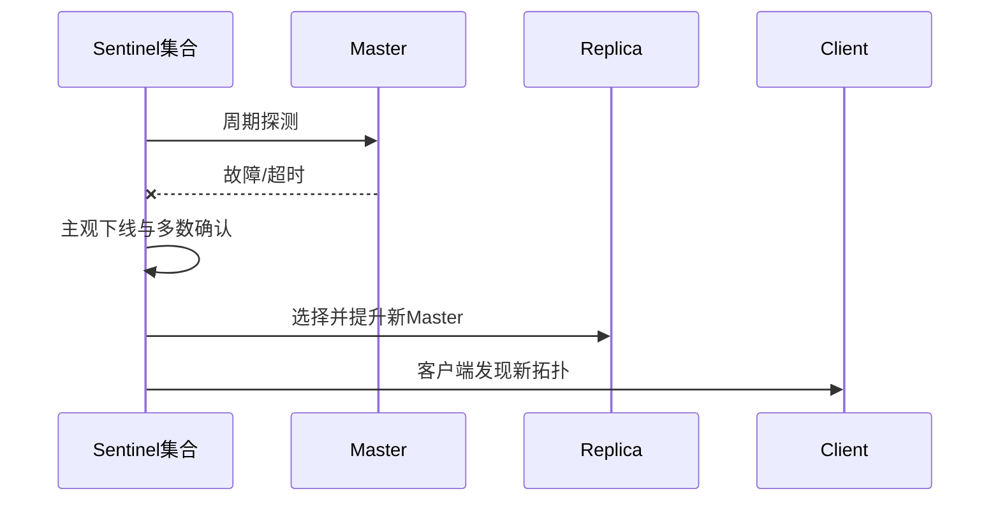

# Redis 持久化、复制与高可用

[[02-数据结构与场景选型|上一篇：数据结构]] · [[00-Redis面试知识地图|知识地图]] · [[04-Lua原子操作与多级缓存|下一篇：Lua与多级缓存]]

## 1. 三个概念必须分开

| 概念 | 解决什么 | 没有单独解决什么 |
|---|---|---|
| RDB/AOF 持久化 | 实例重启后的数据恢复 | 自动故障切换、绝对零丢失 |
| 主从复制 | 数据副本、读扩展、高可用基础 | 自动选主、同步零丢失 |
| Sentinel/Cluster | 监控、选主和故障转移 | 所有已确认写入绝不丢失 |

持久化不是备份的同义词；副本也不是独立冷备。误删除、逻辑错误或损坏可能传播到副本，因此仍需独立备份和恢复演练。

## 2. RDB 快照

RDB 在某个时间点生成数据集快照，常见触发方式包括 `save` 配置、`BGSAVE` 和受控场景下的 `SAVE`。

```conf
save 60 1000
```

优点：文件紧凑、适合备份和全量传输、通常恢复较快。

代价：两次快照之间的最新写入可能丢失；生成快照会产生 CPU、内存和磁盘 I/O 压力，数据量大时需关注 fork 和写时复制成本。

## 3. AOF 追加日志

AOF 记录会改变数据集的命令，启动时重放以恢复数据。耐久性主要由 `appendfsync` 决定：

| 策略 | 含义 | 取舍 |
|---|---|---|
| `always` | 每次写入尽量 fsync | 更安全，性能成本最高 |
| `everysec` | 通常每秒 fsync | 常见折中；灾难时可能丢失约 1 秒数据 |
| `no` | 交给操作系统决定 fsync | 性能较高，数据丢失窗口更不可控 |

AOF 会通过 rewrite 压缩冗余历史命令。Redis 7 起使用多部分 AOF：manifest 管理 base 文件与 incremental 文件；base 可使用 RDB 前导格式，后续追加增量命令。

同时启用 RDB 与 AOF 时，Redis 启动通常优先使用更完整的 AOF 恢复数据。不要手工截断或编辑生产 AOF 来“验证优先级”；应在隔离环境备份后使用官方检查和修复工具，并记录 Redis 版本与目录结构。

## 4. RDB 与 AOF 对比

| 维度 | RDB | AOF |
|---|---|---|
| 记录方式 | 时间点快照 | 写命令追加与重放 |
| 数据丢失窗口 | 可能丢两次快照之间的数据 | 取决于 fsync 策略 |
| 恢复速度 | 通常较快 | 取决于文件及重写形式 |
| 文件与写放大 | 文件紧凑，生成快照有阶段性开销 | 持续追加，需要 rewrite |
| 典型角色 | 全量备份、恢复、复制全量同步 | 提高实例重启后的数据耐久性 |

生产选择要结合可接受数据丢失量 RPO、可接受恢复时间 RTO、磁盘性能和实际压测，不能只背“混合模式最好”。

## 5. 主从复制

主节点通常承担写入，并把数据变化复制给 Replica；Replica 默认只读，可承担部分读取和作为故障切换候选。

### 5.1 全量同步

```text
Replica 建立连接并协商复制信息
→ 无法部分同步时，Master 生成/提供全量数据
→ Replica 加载全量数据
→ Master 将同步期间新增写入继续发送给 Replica
```

### 5.2 部分同步

短暂断线重连后，Replica 会携带复制 ID 和 offset 请求续传。如果 Master 的复制 backlog 仍保留缺失命令且复制关系匹配，就可进行部分同步；否则退化为全量同步。

关键词：**replication ID、offset、replication backlog、PSYNC**。

### 5.3 配置与检查

```conf
replicaof <master-host> 6379
masterauth <password>
replica-read-only yes
```

```redis
INFO replication
REPLICAOF <host> <port>
REPLICAOF NO ONE
```

不要在笔记或仓库里保存真实密码；实验配置使用占位符或环境变量。

## 6. Sentinel 与故障转移

基础主从复制不会自动把 Replica 提升为新主。Sentinel 在达到约定判断后可执行监控、故障判定、选主、提升 Replica，并通知其他 Replica 和客户端更新拓扑。



实际恢复时间受故障判定、选举、复制状态、客户端重连和 DNS/连接池配置影响，不能说“业务不中断”。

## 7. 异步复制的核心边界

Redis 复制通常是异步的：Master 向客户端确认写入时，Replica 可能尚未收到该写入。如果 Master 此时故障且未同步写入的 Replica 被提升，最近数据可能丢失。

`min-replicas-to-write`、`min-replicas-max-lag` 或等待副本确认类手段可以缩小风险，但不能把系统变成严格同步复制和绝对零丢失。

这也是 Redis 分布式锁在主从切换时可能出现“双持有者”的原因之一。关键业务必须由数据库唯一约束、条件更新、幂等和状态机兜底。

## 8. 安全实验清单

1. 在隔离 Docker 环境写入测试 Key，执行 `BGSAVE`，检查 `LASTSAVE` 和日志。
2. 分别记录 AOF `everysec` 与关闭 AOF 时的文件、日志和恢复结果。
3. 使用 `INFO replication` 记录主从角色、连接状态和 offset。
4. 短暂断开 Replica，重连后观察部分同步还是全量同步。
5. 停止 Master，记录“只有主从但没有 Sentinel”时是否仍具备写能力。

不要直接破坏唯一的持久化文件；实验前复制到独立目录，明确可恢复路径。

## 9. 60 秒回答

> RDB 是时间点快照，文件紧凑、恢复通常较快，但可能丢失两次快照之间的数据；AOF 记录写命令，数据丢失窗口由 fsync 策略决定，文件需要重写，Redis 7 使用 manifest 管理 base 和 incremental AOF。主从复制通过全量同步和基于复制ID、offset、backlog的部分同步维护副本，Sentinel负责监控和故障转移。但复制通常是异步的，切换时可能丢最近写入，因此持久化、复制和高可用都不能等同于绝对零丢失，关键业务仍需数据库和幂等防线。

## 10. 高频自测

1. RDB 和 AOF 分别记录什么？主要取舍是什么？
2. `appendfsync always/everysec/no` 有什么区别？
3. Redis 7 多部分 AOF 中 base、incremental 和 manifest 分别是什么？
4. 部分同步需要哪些关键条件？
5. 基础主从复制为什么不能自动恢复写能力？
6. Sentinel 做了什么，为什么仍不能承诺业务完全无感？
7. 为什么主从切换可能丢失已经由旧 Master 确认的最近写入？

