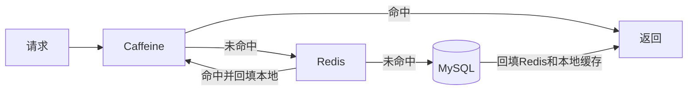
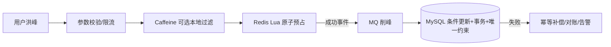

# Redis Lua 原子操作与多级缓存

[[03-持久化、复制与高可用|上一篇：持久化与高可用]] · [[00-Redis面试知识地图|知识地图]] · [[01-缓存与分布式锁|缓存与锁]]

## 1. Lua 在 Redis 中解决什么

普通客户端分两次执行：

```text
GET quota
→ 应用判断余额
→ DECRBY quota amount
```

`GET` 与 `DECRBY` 之间可能插入其他请求，导致多个请求都基于旧余额判断。Lua 把检查、扣减和幂等标记放到 Redis 服务端连续执行，脚本执行期间不会被其他普通命令插入。

### 1.1 额度预占示例

```lua
-- KEYS[1] 额度Key，例如 quota:{merchant-1}
-- KEYS[2] 已处理业务ID集合，例如 quota:done:{merchant-1}
-- ARGV[1] 业务ID
-- ARGV[2] 扣减额度

if redis.call('sismember', KEYS[2], ARGV[1]) == 1 then
    return 2  -- 已处理，幂等返回
end

local balance = tonumber(redis.call('get', KEYS[1]) or '0')
local amount = tonumber(ARGV[2])

if amount <= 0 or balance < amount then
    return 0  -- 参数非法或余额不足
end

redis.call('decrby', KEYS[1], amount)
redis.call('sadd', KEYS[2], ARGV[1])
return 1
```

返回值必须形成稳定协议，例如 `0=不足/非法、1=成功、2=重复请求`，由调用方明确处理。

## 2. Lua 的边界

- Lua 保证脚本内 Redis 命令连续执行，不等于 Redis 与 MySQL 形成一个事务。
- 脚本运行时出错不应被描述成数据库事务式的“全部自动回滚”；应在写入前完成参数校验，保持脚本短小并测试错误分支。
- 长循环和复杂计算会阻塞 Redis 处理其他命令。
- Redis Cluster 中，一个脚本操作的多个 Key 必须位于同一 Hash Slot，常用相同 Hash Tag，例如 `quota:{merchant-1}` 与 `quota:done:{merchant-1}`。
- 脚本或 Functions 的加载方式、缓存和版本行为要按实际 Redis/客户端版本验证；不要只背 `EVALSHA` 而不处理脚本未加载情况。
- Redis 主从切换和持久化仍有边界，MySQL 条件更新、事务、唯一约束和对账不能省略。

## 3. 补偿为什么必须幂等

```text
Redis预占成功
→ MySQL条件扣减/发券失败
→ MySQL事务回滚
→ 按业务ID执行Redis补偿
```

如果同一补偿执行两次都直接 `INCRBY`，额度会被多加。因此要保存补偿业务 ID 或设计状态机，使相同业务只恢复一次。同步补偿也可能因网络、进程宕机或 Redis 故障失败，需要补偿任务、重试、对账和告警。

### 三个最小测试

| 测试 | 初始状态 | 操作 | 预期 |
|---|---|---|---|
| 预占成功 | 额度10，无业务标记 | 业务A扣3 | 返回1，额度7，业务A已记录 |
| 余额不足 | 额度2，无业务标记 | 业务B扣3 | 返回0，额度2，无成功标记 |
| 重复与补偿 | 业务A已扣3 | 再次预占并重复补偿 | 预占返回幂等结果；额度只恢复一次 |

## 4. Caffeine + Redis 多级缓存

Caffeine 是 JVM 进程内缓存；Redis 是多个服务节点共享的远程缓存。

| 维度 | Caffeine | Redis |
|---|---|---|
| 位置 | JVM 堆内 | 独立服务进程 |
| 访问成本 | 无网络和序列化往返 | 有网络与序列化成本 |
| 多节点共享 | 否，每个实例一份 | 是，多个实例访问同一逻辑缓存 |
| 容量约束 | 受单 JVM 堆和 GC 影响 | 受 Redis 内存、淘汰与集群容量影响 |
| 一致性难点 | 多实例副本失效 | 数据库与缓存双写窗口 |

### 4.1 读取链路



适合放入本地缓存的数据：读取极热、体积小、允许很短时间旧值，例如活动规则、商品展示信息和短 TTL 售罄标记。

### 4.2 风险与治理

- 必须设置 `maximumSize` 或权重，避免本地缓存无上限挤占堆并加重 GC。
- 多个实例各有副本，更新时不能只删当前节点；可使用短 TTL、版本校验或失效广播，但广播也可能失败。
- 本地售罄标记适合快速失败，但不能代替 Redis/MySQL 的真实库存判断，也要设置合理过期与恢复逻辑。
- 自动加载应防止同一个 Key 并发回源，并避免把数据库异常长期缓存成正常结果。
- 性能提升必须通过压测和监控证明，不背“快上千倍、拦截 99%”等无实验数据。

## 5. 高并发漏斗的正确口径



职责：

- Redis：快速预筛选和原子预占，降低数据库直接承受的热点压力；
- MQ：解耦和削峰，但生产、路由、消费与业务提交仍有故障窗口；
- MySQL：事实源，通过条件更新、`affectedRows`、事务和唯一约束保证最终业务约束；
- 补偿与对账：处理跨系统无法放入同一事务的失败窗口。

不要说 Redis “决定最终胜者”或 MySQL “保证绝对准确”。更准确的表述是：Redis 给出临时预占结果，MySQL 按权威状态再次校验；系统通过幂等、补偿和对账趋向最终一致，未验证的机制要明确说是设计方案。

## 6. 与分布式锁的关系

Lua 既可以用于额度原子预占，也可以用于分布式锁的所有权校验释放：

```lua
if redis.call('get', KEYS[1]) == ARGV[1] then
    return redis.call('del', KEYS[1])
end
return 0
```

两者目标不同：额度脚本是在 Redis 内原子执行业务状态转换；锁脚本是在释放时防止误删他人的锁。二者都不能跨 Redis 与数据库提供全局事务。

## 7. 60 秒回答

> Redis Lua 的价值是把检查、扣减和幂等标记放在服务端连续执行，避免客户端多条命令之间的并发插入。在额度场景中，Redis只做快速预占，MySQL仍通过余额条件、版本号、事务和唯一约束作为事实源；数据库失败后执行幂等补偿，补偿失败再由任务、对账和告警处理。对于极热点读取，还可在Redis前增加Caffeine本地缓存，但它会带来多实例不一致和JVM堆压力，所以必须限制容量、设置短TTL并保留Redis和数据库防线。

## 8. 高频自测

1. 为什么 `GET` 后再 `DECRBY` 存在竞态？
2. Lua 的原子执行与数据库事务回滚有什么区别？
3. Redis Cluster 中 Lua 操作多个 Key 为什么要使用相同 Hash Tag？
4. 重复补偿为什么可能把额度加多？如何设计幂等？
5. Caffeine 和 Redis 各解决什么问题？
6. 本地售罄标记为什么不能作为最终库存依据？
7. Redis、MQ、MySQL 在并发漏斗中的职责和失败边界分别是什么？

